# Bradykinin Physiology
## 01 Introduction to Bradykinin
Welcome to Section 1!

This section provides a comprehensive overview of bradykinin,
a pivotal nonapeptide that plays essential roles in vascular
regulation, inflammation and pain signaling. You will explore the
historical discovery of bradykinin, the evolution of its scientific
understanding, and its lasting impact on both basic research
and clinical medicine. You’ll gain insights into how discoveries
surrounding bradykinin shaped modern pharmacology and inspired
major therapeutic breakthroughs, such as the development of
bradykinin receptor antagonists.

After completing this section, you will be able to:

• Describe the historical discovery and scientific milestones that defined bradykinin research

### 1.1 Historical Discovery and Scientific Milestones
Bradykinin is a nonapeptide mediator with roles in vascular regulation, inflammation and pain signaling.1-3 Its discovery, mechanism of action, and subsequent clinical importance have influenced both basic and translational medical science.1-4 Bradykinin was discovered serendipitously in 1948 by Maurício Oscar da Rocha e Silva, who was working with colleagues at the Biological Institute of São Paulo, Brazil.2,4 Their research originally aimed to understand the effects of snake venoms, specifically Bothrops jararaca, on vascular shock. 2,5 This investigation led to the identification of a new vasoactive principle responsible for contraction/relaxation of smooth muscle and vascular regulation.2,4 This new substance was distinguished from histamine by its kinetics, and from previously known mediators by its biochemical properties. Consequently, the substance was aptly named “bradykinin” (from the Greek “brady,” meaning slow, and “kinin,” meaning movement).2,4 Further work demonstrated the roles of bradykinin in inflammation1,3,4 [Figure 1].

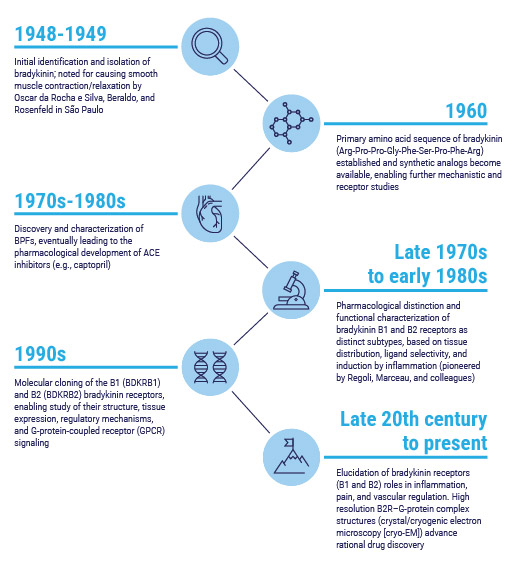
Figure 1: Scientific milestones for bradykinin discovery1-5,9-11
ACE, angiotensin-converting enzyme; BPF, bradykinin-potentiating factor.

What is a nonapeptide?
A nonapeptide is a peptide made of nine amino acids.

Oscar da Rocha e Silva’s pivotal experiments demonstrated that enzymatic action, by trypsin or specific venom proteases, could release this potent peptide from a plasma globulin precursor, later identified as kininogen.2,3 The ability of bradykinin to induce pronounced vasodilation and
smooth muscle contraction/relaxation [dependent on tissue type/body location] was quickly observed in several animal tissues and bioassay systems, especially in the guinea pig ileum and rabbit aorta, which remain classic models in peptide pharmacology.1-4

Bradykinin promotes vasodilation by inducing release of prostacyclin (PGI2) and nitric oxide (NO) from endothelial cells. NO induces relaxation of vascular smooth muscle cells, resulting in blood vessel dilation. Kinins can also induce contraction of smooth muscle cells in other systems such as in the guinea pig ileum, the rabbit aorta and jugular vein. Additionally, bradykinin can cause
constriction of the smooth muscle in the bronchioles, leading to bronchoconstriction, which may contribute to the pathophysiology of conditions such as asthma. The differential effects of bradykinin on different types of smooth muscle cells may be due to phenotypic differences of the different types of smooth muscle cells and/or the different systems/tissues, and the fact that bradykinin receptors may be coupled to different second-messenger mechanisms in the different systems.6-8

Subsequent studies by Sérgio Ferreira revealed that certain peptides in Bothrops venom, termed bradykininpotentiating factors (BPFs), could inhibit the inactivation of bradykinin in vivo by blocking kinase II/ACE,2,5 ultimately leading to the development of ACE inhibitors as antihypertensive drugs.2,5

### Summary:

• Discovered in 1948 by Maurício Oscar da Rocha e Silva during studies on Bothrops
jararaca venom; named for its “slow-moving” smooth-muscle contraction properties.1,2,4
• Bradykinin research catalyzed a new era in therapeutic pharmacology.2,5

### References
1. Stewart JM. Bradykinin antagonists: discovery and development. Peptides. 2004;25:527-532.
2. Hawgood BJ. Snake venom, bradykinin and the rise of autopharmacology. Toxicon.
1997;35(11):1569-1580.
3. Golias Ch, Charalabopoulos A, Stagikas D, Charalabopoulos K, Batistatou A. The kinin systembradykinin:
biological effects and clinical implications. Multiple role of the kinin system—
bradykinin. Hippokratia. 2007;11(3):124-128.
4. Prado GN, Taylor L, Zhou X, Ricupero D, Mierke DF, Polgar P. Mechanisms regulating the
expression, self-maintenance, and signaling-function of the bradykinin B2 and B1 receptors. J
Cell Physiol. 2002;193(3):275-286.
5. Downey P. Profile of Sérgio Ferreira. Proc Natl Acad Sci U S A. 2008;105(49):19035-19037.
6. Minshall RD, et al. Potentiation of the effects of bradykinin on its receptor in the isolated
guinea pig ileum. Peptides. 2000;21(8):1257-1264.
7. Calixto JB, Medeiros YS. Effect of protein kinase C and calcium on bradykinin-mediated
contractions of rabbit vessels. Hypertension. 1992;19(2 Suppl):II87-93.
8. Fuller RW, et al. Bradykinin-induced bronchoconstriction in humans. Mode of action. Am Rev
Respir Dis. 1987;135(1):176-180.
9. Marceau F, Bachelard H, Bouthillier J, et al. Bradykinin receptors: Agonists, antagonists,
expression, signaling, and adaptation to sustained stimulation. Int Immunopharmacol.
2020;82:106305.
10. Shen J, Zhang D, Fu Y, Chen A, Yang X, Zhang H. Cryo-EM structures of human bradykinin
receptor-Gq proteins complexes. Nat Commun. 2022;13(1):714.
11. Menke JG, Borkowski JA, Bierilo KK, et al. Expression cloning of a human B1 bradykinin
receptor. J Biol Chem. 1994;269(34):21583-21586.

## 02 Bradykinin Generation

### INTRODUCTION
Welcome to Section 2!
This section examines the complex process of bradykinin generation
and regulation, detailing how multiple enzymatic systems and genetic
variants contribute to its generation in both normal and disease
states. You will explore the classical kallikrein–kinin pathway, as well
as emerging alternative routes that operate during inflammation, and
genetic dysregulation. The section also discusses how developmental,
age-related, and species-specific differences influence bradykinin
production and control.

After completing this section, you will be able to:
• Explain how bradykinin is produced from kininogen precursors
• Differentiate between plasma and tissue kallikrein pathways
• Understand alternative, kallikrein-independent routes of
bradykinin generation
• Recognize the effects of specific factors, such as genetic
variants on bradykinin levels
• Understand how developmental and species differences
shape biosynthetic regulation

### 2.1 Overview
This section is detailed but important as it outlines the multiple pathways resulting in bradykinin production, and what
leads to increased bradykinin production. This matters as these actions can occur in multiple medical conditions that could
potentially be managed with a bradykinin receptor blocking agent, such as deucrictibant.

#### 2.1.1 Formation of bradykinin
Multiple biological pathways, including the kallikrein-kinin system, lead to the formation of bradykinin [Figure 2].

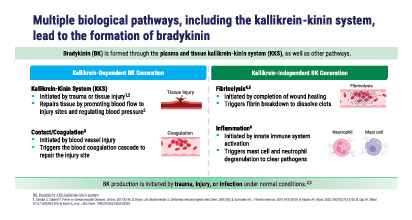
Figure 2: Overview of biological systems involved in bradykinin formation, which occurs via allikrein-dependent and kallikrein-independent
biological pathways
BK, bradykinin; KKS, kallikrein-kinin system.

The generation of bradykinin is a multifaceted process involving multiple enzymatic pathways and regulatory mechanisms.2 While the traditional kallikrein–kinin system remains the predominant pathway for bradykinin generation, historic and emerging evidence describes alternative pathways that can contribute to bradykinin formation, particularly under pathological conditions.

What is the kallikrein-kinin system?
The kallikrein-kinin system (KKS) consists of coagulation factor XII (FXII), the complex of
prekallikrein (PK) and high molecular weight kininogen (HMWK). Conversion of plasma prekallikrein to
plasma kallikrein (pKal) by activated FXII, in response to different stimuli, leads to the generation of
pharmacologically active peptides called kinins (such as bradykinin).1

At its core, generation of bradykinin is dependent on the proteolytic cleavage of precursor proteins, known as kininogens.3 In humans, two main forms of kininogens serve as substrates: high-molecular-weight kininogen (HMWK) and low-molecular-weight kininogen (LMWK), both derived from a single gene (KNG1) through alternative RNA splicing. Cleavage of HMWK and LMWK by different proteases results in generation of active kinins: bradykinin and kallidin [Figure 3]. Proteolytic cleavage of bradykinin and kallidin by peptidases lead to generation of active kinin metabolites, Des-Arg9-BK and Des-Arg10-KD, respectively
[Figure 3]. This occurs via various pathways, which we will look at next.3,4

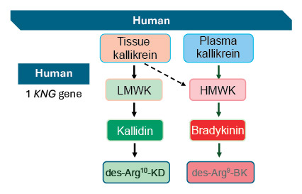
Module 1 | Bradykinin Physiology CONFIDENTIAL – FOR INTERNAL TRAINING ONLY. 12
02| Bradykinin Generation
Figure 3: Kinin precursor proteins LMWK and HMWK are derived from the same gene via alternative splicing5
Arg, arginine; BK, bradykinin; HMWK, high-molecular-weight kininogen; KD, kallidin; KNG, kininogen; LMWK, low-molecular-weight kininogen.

Figure 4 provides an overview of the pathways involved in bradykinin formation, including both allikrein-dependent and kallikrein-independent processes. We will look at each pathway in more detail in this module.

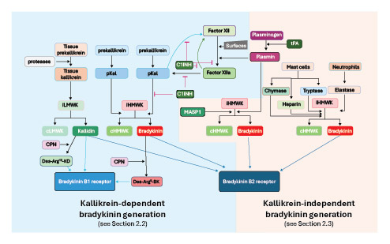
Figure 4: Overview of bradykinin-forming cascades, which can be kallikrein-dependent or  kallikrein-independent5
Arg, arginine; BK, bradykinin; C1INH, C1-esterase inhibitor; cHMWK, cleaved high-molecular-weight kininogen; cLMWK, cleaved low-molecular-weight kininogen; CPN, carboxypeptidase N; FXII, factor XII (Hageman factor); HMWK, high-molecular-weight kininogen; iHMWK, intact high-molecular-weight kininogen;; iLMWK, intact low-molecularweight kininogen; KD, kallidin; LMWK, low-molecular-weight kininogen; MASP1, Mannan-binding lectin serine protease 1; pKal, plasma kallikrein; tPA, tissue plasminogen activator.

### 2.2 Kallikrein-Dependent Bradykinin Generation
Bradykinin generation often, but not exclusively, centers on the kallikrein–kinin system, which consists of two distinct but related enzymatic cascades: the pKal system and the tissue kallikrein system.6 These systems differ in their regulation, activation mechanisms, and substrate preferences, and will be discussed below in more detail.6

#### 2.2.1 The Contact System and Plasma Kallikrein Pathway
The contact system represents the primary mechanism for bradykinin generation in plasma and involves three key proteins:
factor XII (FXII, also known as Hageman factor), plasma prekallikrein, and HMWK [Figure 5].6,7 The system is activated when FXII encounters negatively charged surfaces, including damaged endothelium, collagen, bacterial lipopolysaccharides, or artificial surfaces such as those of medical devices.6,7

Upon surface contact, FXII undergoes conformational changes leading to its autoactivation to factor XIIa (FXIIa).6 Activated FXIIa then cleaves plasma prekallikrein, which circulates in complex with HMWK to generate active pKal. This creates a positive feedback loop, as pKal can reciprocally activate more FXIIa, which in turn can activate more plasma prekallikrein, resulting in amplification of the
activation of the contact system and pKal pathway.6

The activated pKal cleaves HMWK at two specific sites:
the Lys-Arg bond at the N-terminus and the Arg-Ser bond at the C-terminus of the bradykinin sequence [Figure 6].6,8 
This dual cleavage liberates bradykinin, leaving behind the heavy and light chains of kininogen connected by disulfide bonds, forming what is termed ‘cleaved’ HMWK (Figure 6).8

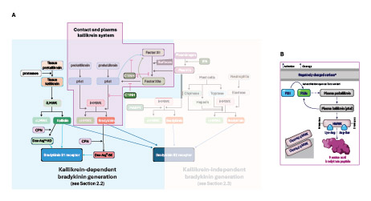
Figure 5: Contact and plasma kallikrein system (A) in context of other pathways;5 (B) in detail.6-8
*Negatively charged surfaces include damaged endothelium, collagen, bacterial liposaccharides, and medical devices.
Arg, arginine; BK, bradykinin; C1INH, C1-esterase inhibitor; cHMWK, cleaved high-molecular-weight kininogen; cLMWK, cleaved low-molecular-weight kininogen; CPN, carboxypeptidase N; FXII, factor XII (Hageman factor); HMWK, high-molecular-weight kininogen; iHMWK, intact high-molecular-weight kininogen; iLMWK, intact low-molecularweight kininogen; KD, kallidin; LMWK, low-molecular-weight kininogen; MASP1, Mannan-binding lectin serine protease 1; pKal, plasma kallikrein; tPA, tissue plasminogen activator.

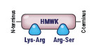
Figure 6: Plasma kallikrein cleavage sites in HMWK: Lys-Arg bond at the N-terminus and the Arg-Ser bond at the C-terminus of the bradykinin sequence
Arg, arginine; HMWK, high-molecular-weight kininogen; Lys, lysine; Ser, serine.

#### 2.2.2 Endothelial Cell-Bound Plasma Kallikrein–Kinin System
The contact system can also function on endothelial cell surfaces through a distinct mechanism. HMWK binds to
endothelial cells via interaction with cytokeratin 1 and the globular C1q receptor (gC1qR) in a zinc-dependent manner.9 In this cell-bound system, plasma prekallikrein complexed with HMWK can be activated by heat shock protein 90 (Hsp90), resulting in pKal cleavage of HMWK and bradykinin generation, independent of FXIIa.9,10
Additionally, an alternative endothelial activation pathway involves plasma prekallikrein activation
by prolylcarboxypeptidase, further diversifying the mechanisms of bradykinin formation.6,7

#### 2.2.3 Tissue Kallikrein System
The tissue kallikrein system [Figure 7] operates independently of the contact system and involves tissue
kallikrein, which is produced by various tissues including salivary glands, pancreas, kidney, lung, and heart.11 Unlike
pKal, tissue kallikrein preferentially cleaves LMWK to generate kallidin (Lys-bradykinin), which aminopeptidase P
can cleave and convert to bradykinin.11 

Tissue kallikrein can also cleave HMWK, however with lower efficiency. The regulation of tissue kallikrein involves
specific inhibitors such as kallistatin and α1-antitrypsin, and its activation can be mediated by various proteases.12 

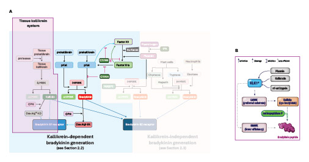
Figure 7: Tissue kallikrein system (A) in context of other pathways;5 (B) in detail.11,12
*Produced by various tissues (e.g., salivary glands, pancreas, kidney, lung, and heart).
Arg, arginine; BK, bradykinin; C1INH, C1-esterase inhibitor; cHMWK, cleaved high-molecular-weight kininogen; cLMWK, cleaved low-molecular-weight kininogen; CPN, carboxypeptidase N; FXII, factor XII (Hageman factor); HMWK, high-molecular-weight kininogen; iHMWK, intact high-molecular-weight kininogen; iLMWK, intact low-molecularweight
kininogen; KD, kallidin; KLK1, tissue kallikrein; LMWK, low-molecular-weight kininogen; Lys, lysine; MASP1, Mannan-binding lectin serine protease 1; pKal, plasma kallikrein; tPA, tissue plasminogen activator.

### 2.3 Kallikrein-Independent Bradykinin Generation
Extensive research has revealed multiple alternative pathways for bradykinin generation that operate independently of the traditional kallikrein systems. These pathways may become particularly relevant during certain inflammatory conditions.

#### 2.3.1 Fibrinolytic System-Mediated Generation
The fibrinolytic system, primarily through plasmin activity, represents a significant alternative pathway for bradykinin production [Figure 8]. Plasmin, generated from plasminogen by tissue plasminogen activator (tPA) and other activators, can directly cleave both HMWK and LMWK to release bradykinin and kallidin, respectively, independent of FXIIa and pKal activity.13

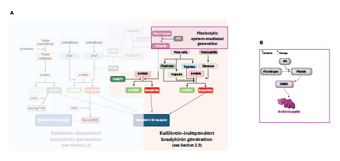
Figure 8: Fibrinolytic system (A) in context of other pathways;5 (B) in detail.13
Arg, arginine; BK, bradykinin; C1INH, C1-esterase inhibitor; cHMWK, cleaved high-molecular-weight kininogen; cLMWK, cleaved low-molecular-weight kininogen; CPN, carboxypeptidase N; FXII, factor XII (Hageman factor); HMWK, high-molecular-weight kininogen; iHMWK, intact high-molecular-weight kininogen; iLMWK, intact low-molecularweight
kininogen; KD, kallidin; LMWK, low-molecular-weight kininogen; MASP1, Mannan-binding lectin serine protease 1; pKal, plasma kallikrein; tPA, tissue plasminogen activator.

This mechanism can have particular clinical relevance in certain types of AE-BK, such as with plasminogen variants
(HAE-PLG) and with variants in the KNG1 gene (HAE-KNG) [see Module 1 Section 5 for a detailed overview of variants of interest in AE-BK].

#### 2.3.2 Inflammatory Cell-Derived Protease-Mediated Generation and Lectin Complement System-Mediated Generation
There are other ways in which bradykinin can be generated. These are based on experimental evidence from in vitro and preclinical animal studies/models. Their relevance/contribution to AE-BK and other bradykinin-mediated diseases remains to be established; they are included here for completeness of bradykinin biology.

During inflammatory responses, various cell types release proteases capable of processing kininogens to generate
bradykinin [Figure 9]. These proteases include:
• Mast cell proteases (e.g., tryptase, chymase):
• Tryptase, the predominant protease in mast cell granules, cleaves HMWK and LMWK with limited efficiency when
acting alone; however, in cooperation with neutrophil elastase, the system supports bradykinin generation.8
• Chymase, a chymotrypsin-like neutral protease released from activated mast cells, can directly cleave highmolecular weight kininogen (HMWK) and thereby release bradykinin—independently of factor XII (FXII) and plasma
kallikrein (pKal).14
• Neutrophil-derived enzymes: Neutrophil elastase not only cooperates with tryptase but can also modify kininogen
substrates to enhance susceptibility to kallikrein cleavage. Elastase cleaves fragments from LMWK, rendering it more accessible to pKal processing.8 Additionally, neutrophil-derived proteinase 3 (PR3) can cleave HMWK to generate PR3 kinin, a tridecapeptide that can be processed into bradykinin, through a pKal-independent mechanism.15

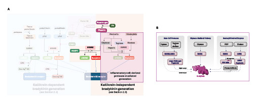
Figure 9: Bradykinin generation through inflammatory cell-derived proteases; (A) in context of other pathways;5 (B) in detail.8,15
*Plasma kallikrein independent mechanism.
Arg, arginine; BK, bradykinin; C1INH, C1-esterase inhibitor; cHMWK, cleaved high-molecular-weight kininogen; cLMWK, cleaved low-molecular-weight kininogen; CPN, carboxypeptidase N; FXII, factor XII (Hageman factor); HMWK, high-molecular-weight kininogen; iHMWK, intact high-molecular-weight kininogen; iLMWK, intact low-molecularweight
kininogen; KD, kallidin; LMWK, low-molecular-weight kininogen; MASP1, Mannan-binding lectin serine protease 1; pKal, plasma kallikrein; PR3, proteinase 3; tPA, tissue plasminogen activator.

Another potential pathway for bradykinin generation is the complement lectin pathway – it appears to contribute to
bradykinin generation through mannose-binding lectin-associated serine protease-1 (MASP-1) (Figure 10). MASP-1
possesses the ability to cleave both HMWK and, to a lesser extent, LMWK, resulting in bradykinin generation independent of FXII and pKal.10

What is MASP-1?
MASP-1 (mannose-binding lectin-associated serine protease 1) is a protein that plays a key role in the
body’s immune system and blood clotting. It is a component of the lectin complement pathway, which
is part of the innate immune response, and is also involved in regulating inflammation and promoting
blood coagulation.16

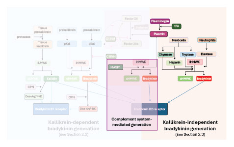
Figure 10: Complement system-mediated generation in context of other pathways5
Arg, arginine; BK, bradykinin; C1INH, C1-esterase inhibitor; cHMWK, cleaved high-molecular-weight kininogen; cLMWK, cleaved low-molecular-weight kininogen; CPN, carboxypeptidase N; FXII, factor XII (Hageman factor); HMWK, high-molecular-weight kininogen; iHMWK, intact high-molecular-weight kininogen; iLMWK, intact low-molecularweight
kininogen; KD, kallidin; LMWK, low-molecular-weight kininogen; MASP1, Mannan-binding lectin serine protease 1; pKal, plasma kallikrein; tPA, tissue plasminogen activator.

### 2.4 Regulation and Integration of Bradykinin Generation Pathways
The multiple pathways for bradykinin generation are tightly regulated by several inhibitor systems, with C1 inhibitor (C1INH) serving as the primary regulator of the contact system [see Module 2 Section 1]. C1INH inhibits both FXIIa and pKal, effectively controlling the pKal-dependant bradykinin generation pathway.6,11,17,18

#### 2.4.1 Developmental Regulation
The bradykinin biosynthetic pathways undergo significant developmental regulation throughout the human lifespan, with distinct patterns emerging during embryonic development and aging.19,20

| Embryonic and neonatal development | Age-related changes in adults |
| ---------------------------------- | ----------------------------- |
| During embryonic development, bradykinin B2 receptor expression is prominent in neural stem cells, where it determines neuronal fate specification and promotes neurogenesis over gliogenesis.19 The contact system components show developmental specific patterns, with FXII and prekallikrein levels being significantly lower in neonatal plasma compared to adults.21 Kininogen expression follows developmental patterns, with HMWK showing tissue-specific regulation and gradually increasing to adult levels by early childhood.21,22.     | Aging profoundly impacts bradykinin biosynthetic machinery, with bradykinin B2 receptor expression showing agerelated increases in cardiovascular tissues.20 Endothelial responses to bradykinin remain preserved with aging compared to other vasodilators, suggesting maintained pathway functionality even as other endothelium-dependent mechanisms decline.23 However, the contact system undergoes age-related modifications, with altered FXII levels and potentially declining pKal activity contributing to altered inflammatory responses in the elderly.24,25

A clear understanding of the various pathways involved in bradykinin generation is important for interpreting how different drugs act and what their therapeutic effects may be.

Understanding classic and alternative pathways supports the design of targeted, individualized therapies. This is covered in later modules in this training.

### Summary
• Overview: Bradykinin is produced through tightly regulated enzymatic systems that ensure vascular and inflammatory balance. While the kallikrein–kinin system is the main source, several alternative routes can independently generate 
bradykinin under pathological conditions.1,5
• Kallikrein-Dependent Bradykinin Generation
• Contact system and plasma kallikrein pathway:
• Involves FXII, pKal, and HMWK.5-7
• Activated on negatively charged surfaces leading to reciprocal activation of FXII and pKal.5-7
• Generates bradykinin through specific cleavage of HMWK.5,6,8
• Endothelial Cell-Bound Plasma Kallikrein–Kinin System:
• Endothelial cell surfaces generate bradykinin through HMWK binding to cytokeratin 1 and gC1qR, activated by Hsp90 or prolylcarboxypeptidase.6,7,9,10
• Tissue Kallikrein System:
• This system acts independently of the contact system.11
• Tissue kallikrein (KLK1), as the key protein involved, acts preferentially on LMWK to form kallidin, later converted to bradykinin.11
• Kallikrein-Independent Bradykinin Generation
• Fibrinolytic system-mediated generation:
• This system is a significant alternative pathway for bradykinin generation.5
• Plasmin, generated from plasminogen, directly cleaves HMWK and LMWK to release bradykinin and kallidin, respectively, independent of FXIIa and pKal activity.13
• Inflammatory cell-derived protease-mediated generation:
• These pathways are believed to be active during inflammatory responses.5
• Mast cell protease tryptase can cleave both HMWK and LMWK; this process becomes more effective when neutrophil elastase is also involved.8
• Another mast cell protease, chymase, can directly cleave HMWK to release bradykinin independently of FXII and pKal.14
• Neutrophil-derived enzymes, neutrophil elastase and PR3, also contribute to bradykinin generation.8,15
• Lectin Complement System-Mediated Generation:
• The complement lectin pathway can contribute to bradykinin generation through MASP-1, which can cleave HMWK, and to a lesser extent, LMWK.10
• Developmental and Species-Specific Regulation:
• Expression of contact system components, kininogens, and receptors changes with age and organ maturation.19-25

### References
1. Brusco I, et al. Kinins and their B1 and B2 receptors as potential therapeutic targets for pain relief. Life Sciences. 2023;314:121302.
2. Rex DAB, Vaid N, Deepak K, Dagamajalu S, Prasad TSK. A comprehensive review on current understanding of bradykinin in COVID-19 and inflammatory diseases. Mol Biol Rep. 2022;49(10):9915-9927.
3. Zini JM, Schmaier AH, Cines DB. Bradykinin regulates the expression of kininogen binding sites on endothelial cells. Blood. 1993;81(11):2936-2946.
4. Christiansen SC, Banerji A, Bernstein JA, et al. Hereditary Angioedema With Normal C1 Inhibitor: A Quarter Century of Forward Progress and Persisting Obstacles. J Allergy Clin Immunol Pract. 2025;13(6):1300-1309.
5. Riedl MA, et al. The Roles and Relevance of Bradykinin and its B2 Receptor in Health and Disease. In preparation, 2025.
6. Schmaier AH. The contact activation and kallikrein/kinin systems: pathophysiologic and physiologic activities. J Thromb Haemost. 2016;14(1):28-39.
7. Fagerström IL, Gerogianni A, Wendler M, et al. Bradykinin B1 receptor signaling triggers complement activation on endothelial cells. Front Immunol. 2025;16:1527065.
8. Kozik A, Moore RB, Potempa J, Imamura T, Rapala-Kozik M, Travis J. A novel mechanism for bradykinin production at inflammatory sites. Diverse effects of a mixture of neutrophil elastase and mast cell tryptase versus tissue and plasma kallikreins on native and oxidized kininogens. J Biol Chem. 1998;273(50):33224-33229.
9. Kaira BG, Slater A, McCrae KR, et al. Factor XII and kininogen asymmetric assembly with gC1qR/C1QBP/P32 is governed by allostery. Blood. 2020;136(14):1685-1697.
10. Dobó J, Major B, Kékesi KA, et al. Cleavage of kininogen and subsequent bradykinin release by the complement component: mannose-binding lectin-associated serine protease (MASP)-1. PLoS One. 2011;6(5):e20036.
11. Kaplan AP, Joseph K, Silverberg M. Pathways for bradykinin formation and inflammatory disease. J Allergy Clin Immunol. 2002;109(2):195-209.
12. Goettig P, Magdolen V, Brandstetter H. Natural and synthetic inhibitors of kallikrein-related peptidases (KLKs). Biochimie. 2010;92(11):1546-1567.
13. Hofman Z, de Maat S, Hack CE, Maas C. Bradykinin: Inflammatory Product of the Coagulation System. Clin Rev Allergy Immunol. 2016;51(2):152-161.
14. Dell’Italia LJ, Collawn JF, Ferrario CM. Multifunctional Role of Chymase in Acute and Chronic Tissue Injury and Remodeling. Circ Res. 2018;122:319-336.
15. Kahn R, Hellmark T, Leeb-Lundberg LM, et al. Neutrophil-derived proteinase 3 induces kallikrein-independent release of a novel vasoactive kinin. J Immunol. 2009;182(12):7906-7915.
16. Takahashi M, et al. Essential role of Mannose-binding lectin associated serine protease-1 in activation of the complement factor D. J Exp Med 20210;207(1):29-37.
17. Bryant JW, Shariat-Madar Z. Human plasma kallikrein-kinin system: physiological and biochemical parameters. Cardiovasc Hematol Agents Med. Chem. 2009;7(3):234-250.
18. Bork K, Wulff K, Möhl BS, et al. Novel hereditary angioedema linked with a heparan sulfate 3-O-sulfotransferase 6 gene mutation. J Allergy Clin Immunol. 2021;148(4):1041-1048.
19. Trujillo CA, Negraes PD, Schwindt TT, et al. Kinin-B2 receptor activity determines the differentiation fate of neural stem cells. J Biol Chem. 2012;287(53):44046-44061.
20. Liesmaa I, Shiota N, Kokkonen JO, Kovanen PT, Lindstedt KA. Bradykinin type-2 receptor expression correlates with age and is subjected to transcriptional regulation. Int J Vasc Med. 2012;2012:159646.
21. Khizroeva J, Makatsariya A, Vorobev A, et al. The Hemostatic System in Newborns and the Risk of Neonatal Thrombosis. Int J Mol Sci. 2023;24(18):13864.
22. Ignjatovic V, Lai C, Summerhayes R, et al. Age-related differences in plasma proteins: how plasma proteins change from neonates to adults. PLoS One. 2011;6(2):e17213.
23. DeSouza CA, Clevenger CM, Greiner JJ, et al. Evidence for agonist-specific endothelial vasodilator dysfunction with ageing in healthy humans. J Physiol. 2002;542(Pt 1):255-262.
24. Shu Y, Zhao X, Yang C, et al. Circulating prekallikrein levels are correlated with lipid levels in the chinese population: a cross-sectional study. Lipids Health Dis. 2023;22(1):79.
25. Pérez V, Velarde V, Acuña-Castillo C, et al. Increased kinin levels and decreased responsiveness to kinins during aging. J Gerontol A Biol Sci Med Sci. 2005;60(8):984-990.

## 03 Bradykinin Degradation
### INTRODUCTION
Welcome to Section 3!
This section explores the degradation of bradykinin, emphasizing how precise enzymatic control prevents excessive vascular and inflammatory responses. You will examine the role of angiotensin-converting enzyme (ACE or kininase II) as one of the central regulators of bradykinin catabolism, as well as the supporting functions of carboxypeptidase N, aminopeptidase P, and neutral endopeptidase.

This section highlights how imbalances in these systems – whether pharmacologic or genetic – can alter bradykinin levels, contributing to both therapeutic benefits and pathological conditions effects, such as bradykinin-mediated angioedema (AE-BK).

After completing this section, you will be able to:
• Explain how bradykinin is degraded in plasma and tissues
• Describe the structure and function of ACE in bradykinin catabolism
• Identify other enzymes that participate in bradykinin degradation
• Recognize how ACE inhibition affects vascular and inflammatory physiology
• Relate impaired degradation to clinical conditions, such as HAE and acquired angioedema due to C1INH deficiency (AAE-C1INH)

### 3.1 Overview
As you previously learned, bradykinin can be synthesized via several cascades [see Module 1 Section 2]. This is carefully balanced in healthy individuals by its degradation (catabolism). Degradation of bradykinin is highly regulated and critical for limiting its biological activity and preventing pathological sequelae, including vasogenic edema and excessive inflammation [see Module 1 Section 5].1 This section provides an overview of bradykinin catabolism with a focus on angiotensin-converting enzyme (ACE, also known as kininase II) and its role in health and disease.

### 3.2 Enzymatic Pathways of Bradykinin Degradation
Bradykinin is metabolized rapidly in plasma and tissues through the action of several peptidases, of which ACE/kininase II is the most prominent. Upon release, bradykinin’s half-life is extremely short – up to approximately 34 seconds under normal conditions – owing to these enzymatic breakdown processes.1 The degradation, or catabolic, process is summarized in Figure 11. 

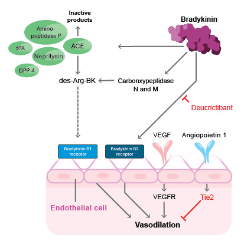
Figure 11: Degradation of bradykinin, involving key enzymes ACE, CPN, aminopeptidase P, NEP, and DPP-42
ACE, angiotensin-converting enzyme; CPN, carboxypeptidase N; DPP-4, dipeptidyl peptidase-4; NEP, neprilysin; Tie2, Tyrosine kinase with immunoglobulin-like and EGF-like domains 2; tPA, tissue plasminogen activator; VEGF, vascular endothelial growth factor; VEGFR, vascular endothelial growth factor receptor.

The primary enzymes involved in bradykinin catabolism include:
• Angiotensin-converting enzyme (ACE/kininase II): This zinc-dependent dipeptidyl carboxypeptidase is expressed as a membrane-bound protein on the luminal surface of endothelial cells, with the highest expression levels found within the pulmonary vasculature.3,4 In this strategic location, ACE acts as the primary gatekeeper for circulating bradykinin, ensuring that peptides are rapidly degraded before exerting systemic effects.3,4 Structurally, human ACE possessestwo catalytic domains (N- and C-terminal) exhibiting distinct kinetic properties and substrate specificities.3,4 While both domains efficiently cleave bradykinin with equal efficiency, they exhibit different preferences for other ubstrates and vary in their tissue-specific expression patterns.3,4 The degradation process involves ACE rapidly removing the biologically essential C-terminal dipeptide Phe-Arg from bradykinin.3,4 The enzyme subsequently performs a second cleavage, removing another dipeptide. This sequential dipeptide removal ensures complete inactivation of bradykinin.3,4
• Carboxypeptidase N (CPN, kininase I): A plasma enzyme that removes the C-terminal arginine residue from bradykinin, producing des-Arg9-bradykinin.5 Unlike bradykinin, des-Arg9-bradykinin cannot activate the constitutive bradykinin B2 receptor. However, it is a preferential agonist at inducible bradykinin B1 receptors, particularly relevant in inflammatory conditions.5

Other enzymes offering substrate redundancy include:
• Aminopeptidase P (APP): Important for bradykinin degradation and involved in ACE inhibitor-induced angioedema6
• Neutral Endopeptidase (NEP): Cleaves at Gly4-Phe5 bond and contributes significantly to bradykinin metabolism6,7
• Dipeptidyl peptidase IV (DPP-4): Involved particularly in the breakdown of substance P, which shares some pathophysiologic features with bradykinin, especially in the context of ACE inhibitor-associated angioedema.8,9

Figure 12 illustrates bradykinin cleavage, with key sites as described above highlighted.Inhibition or dysfunction of any of these peptidases may potentiate bradykinin activity and elevate disease risk.5-9

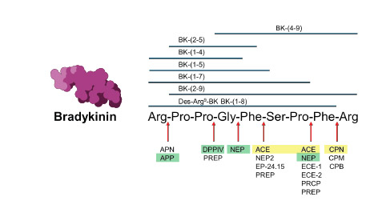
Figure 12: Bradykinin key cleavage sites during degradation. Primary enzymes are shown in yellow; other enzymes are shown in green10
ACE, angiotensin-converting enzyme; APN, aminopeptidase N; APP, aminopeptidase P; Arg, arginine; BK, bradykinin; CP, carboxypeptidase; DPP-4, dipeptidyl peptidase-4; ECE, endothelin-converting enzyme; EP, endopeptidase; Gly, glycine; NEP, neutral endopeptidase; Phe, phenylalanine; PREP, prolyl  endopeptidase; Pro, proline; Ser, serine.

### 3.3 Cellular and Tissue Localization of Bradykinin Degradation
The pulmonary endothelium is widely recognized as the principal site for bradykinin degradation in vivo,attributed to the high surface expression of ACE on pulmonary capillaries.4 Experimental studies have shown diminished bradykinin-degrading capacity in isolated pulmonary endothelium following ACE inhibition, resulting in elevated plasma bradykinin concentrations and enhanced vasodilatory or permeability responses.11 

Bradykinin degradation also occurs at extravascular sites, including within the kidneys, heart, and local tissue microenvironments.12 In these contexts, both membranebound and soluble forms of peptidases—including ACE, CPN, aminopeptidase P, and NEP—contribute to kinin
regulation.12 

When ACE is non-functional or blocked, other proteases become more important for cleaving and metabolizing kinins. As described above, these include carboxypeptidase N (CPN), also known as kininase I, an enzyme which converts bradykinin to des-Arg9-bradykinin, an active metabolite that acts on the bradykinin B1 kinin receptor [see Module 1 Section 3.2]. When ACE is inhibited, these alternative pathways play a more significant role in the overall metabolism of kinins, leading to elevated levels of
kinins and their active metabolites; this contributes to the therapeutic effects (and some side effects like dry cough and angioedema) of ACE inhibitors.13,14 For these reasons, ACEi’s are not administered to patients with AE-BK.14

### 3.4 Functional Implications: ACE Inhibition in Disease Context
ACE’s role in bradykinin metabolism has major clinical implications. Pharmacologic inhibition of ACE (by ACE inhibitors, which are frequently used in hypertension and heart failure) simultaneously impede the generation of angiotensin II and the degradation of bradykinin.15,16

In bradykinin-meditated angioedema (AE-BK), where bradykinin generation is dysregulated [see Module 2 Section 1], the balance between synthesis and degradation becomes critical.16,17 Impaired bradykinin clearance by ACE, especially in the context of ACE inhibitor therapy, can tip the pathway toward tissue swelling and potentially life-threatening edema.16,17

### 3.5 Pathway Products and Analytical Considerations
Bradykinin degradation yields a spectrum of peptide fragments, many of which have little or no activity at kinin receptors and are rapidly further cleaved to dipeptides and single amino acids.18

Key products of kinin (primarily bradykinin and kallidin) metabolism include:
| Biologically Active Metabolites | Biologically Inactive Fragments | Smaller Fragments Produced by ther Enzymes |
| ------------------------------- | ------------------------------- | ------------------------- |
| Des-Arg⁹-bradykinin (des-Arg⁹-BK): Formed when kininase I removes the C-terminal arginine residue from radykinin. This metabolite is an agonist for the kinin B1 receptor, which is typically induced during inflammation.10 | The majority of kinin metabolism leads to inactive fragments, primarily via kininase II (ACE):10 | Bradykinin (2-9): Formed by the action of aminopeptidase P, which removes the N-terminal arginine.10 |
|Lys-des-Arg¹⁰ kallidin: Formed similarly from kallidin (Lys-BK) by kininase I.10 It is also an agonist for the bradykinin B1 receptor.5 |• Bradykinin (1-7): Kininase II cleaves the C-terminal dipeptide (Phe⁸-Arg⁹) from bradykinin, producing this inactive heptapeptide.10 | Bradykinin (1-7) and (1-4) fragments: Produced by neutral endopeptidase (NEP) cleavage at different sites within the peptide sequence.10 |
| | • Bradykinin (1-5): This pentapeptide is a final, inactive metabolite, resulting from further cleavage of bradykinin (1-7) by ACE or from other enzymatic actions.10 | Free amino acids and smaller peptides: The ultimate breakdown products, such as the tripeptide Arg-Pro-Pro, one mole each of Ser, Pro, Gly, and Arg, and  wo moles of phenylalanine.19|
| | • Kallidin (1-8): Formed from kallidin by ACE.20 | |

The instability of bradykinin and its metabolites in biological fluids have made laboratory measurement challenging, thus requiring specialized techniques (e.g., high-performance liquid chromatography (HPLC), immunoassays) for accurate quantification.1,21 
See Module 3, Section 2.2.1 for information on the Pharvaris biomarker in AE-BK.

### 03 Summary
• Overview:
• Bradykinin degradation is a tightly regulated process that limits the peptide’s biological activity and prevents pathologic effects like edema and inflammation. The main enzyme responsible is angiotensin-converting
enzyme (ACE or kininase II), supported by several secondary peptidases.1,3-6
• Primary Enzymes in Bradykinin Degradation:
• ACE/Kininase II: Zinc-dependent dipeptidyl carboxypeptidase expressed on endothelial surfaces, especially in the lungs. Removes C-terminal dipeptides from bradykinin, rapidly inactivating it.3,4
• When ACE activity is inhibited, carboxypeptidase N, aminopeptidase P, and NEP are still functioning and can degrade bradykinin.5-9
• Localization:
• The pulmonary endothelium is the primary site of bradykinin degradation, due to high ACE expression.4
• Local degradation also occurs in the heart, kidneys, and vascular tissues through both membrane-bound and soluble enzymes.11,12
• Functional Implications of ACE:
• Besides its main functions to convert angiotensin I to angiotensin II, ACE is also involved in bradykinin metabolism.15,16
• Inhibition of ACE decreases angiotensin II formation and degradation of bradykinin, resulting in vasodilation and natriuresis.16,17
• Excessive bradykinin accumulation due to ACE inhibition can trigger angioedema, particularly in genetically predisposed individuals or those with hereditary angioedema.16
• Analytical and Research Considerations:
• Bradykinin is highly unstable in biological samples, requiring advanced detection methods such as HPLC and immunoassays.1,18,21
• Quantification of bradykinin and kinin peptides may provide diagnostic insights into disorders involving kinin imbalance.1,18,21
• See Module 3, Section 2.2.1 for information on the Pharvaris biomarker in AE-BK.

### References
1. Marceau F, Rivard GE, Gauthier JM, et al. Measurement of Bradykinin Formation and Degradation in Blood Plasma: Relevance for Acquired Angioedema Associated With Angiotensin Converting Enzyme Inhibition and for Hereditary Angioedema Due to Factor XII or Plasminogen Gene Variants. Front Med (Lausanne). 2020;7:358.
2. Recke A. Status quo and future developments in the diagnosis and treatment of hereditary angioedema. J Dtsch Dermatol Ges. 2025;23(12):1512-1525.
3. Riordan JF. Angiotensin-I-converting enzyme and its relatives. Genome Biol. 2003;4(8):225.
4. Orfanos SE, Langleben D, Khoury J, et al. Pulmonary capillary endothelium-bound angiotensinconverting enzyme activity in humans. Circulation. 1999;99(12):1593-1599.
5. Leeb-Lundberg LM, Marceau F, Müller-Esterl W, Pettibone DJ, Zuraw BL. International union of pharmacology. XLV. Classification of the kinin receptor family: from molecular mechanisms to pathophysiological consequences. Pharmacol Rev. 2005;57(1):27-77.
6. Campbell DJ. Neprilysin Inhibitors and Bradykinin. Front Med (Lausanne). 2018;5:257.
7. Matsas R, Kenny AJ, Turner AJ. The metabolism of neuropeptides. The hydrolysis of peptides, including enkephalins, tachykinins and their analogues, by endopeptidase-24.11. Biochem J. 1984;223(2):433-440.
8. Byrd JB, Touzin K, Sile S, et al. Dipeptidyl peptidase IV in angiotensin-converting enzyme inhibitor associated angioedema. Hypertension. 2008;51(1):141-147.
9. Lepelley M, Khouri C, Lacroix C, Bouillet L. Angiotensin-converting enzyme and dipeptidyl peptidase-4 inhibitor-induced angioedema: A disproportionality analysis of the WHO pharmacovigilance database. J Allergy Clin Immunol Pract. 2020;8(7):2406-2408.e1.
10. Riedl MA, et al. The Roles and Relevance of Bradykinin and its B2 Receptor in Health and Disease. In preparation, 2025.
11. Schilero GJ, Almenoff P, Cardozo C, Lesser M. Effects of peptidase inhibitors on bradykinininduced bronchoconstriction in the rat. Peptides. 1994;15(8):1445-1449.
12. Kokkonen JO, Kuoppala A, Saarinen J, Lindstedt KA, Kovanen PT. Kallidin- and bradykinindegrading pathways in human heart: degradation of kallidin by aminopeptidase M-like activity and bradykinin by neutral endopeptidase. Circulation. 1999;99(15):1984-1990.
13. Skidgel RA. Bradykinin-degrading enzymes: structure, function, distribution, and potential roles in cardiovascular pharmacology. J Cardiovasc Pharmacol. 1992:20 Suppl 9:S4-9.
14. Pirahanchi Y, Sharma S. Physiology, Bradykinin. StatPearls. Last Update: July 11, 2023. Available at: https://www.ncbi.nlm.nih.gov/books/NBK537187/#:~:text=Angiotensin%2Dconverting%20enzyme%20(ACE)%20is%20an%20enzyme%20that%20breaks,angiotensin%20I%20to%20angiotensin%20II. Accessed April 2026.
15. Gainer JV, Morrow JD, Loveland A, King DJ, Brown NJ. Effect of bradykinin-receptor blockade on the response to angiotensin-converting-enzyme inhibitor in normotensive and hypertensive subjects. N Engl J Med. 1998;339(18):1285-1292.
16. Kostis WJ, Shetty M, Chowdhury YS, Kostis JB. ACE Inhibitor-Induced Angioedema: a Review. Curr Hypertens Rep. 2018;20(7):55.
17. Busse PJ, Christiansen SC. Hereditary Angioedema. N Engl J Med. 2020;382(12):1136-1148.1
18. Murphey LJ, Hachey DL, Vaughan DE, Brown NJ, Morrow JD. Quantification of BK1-5, the stable bradykinin plasma metabolite in humans, by a highly accurate liquid-chromatographic tandem mass spectrometric assay. Anal Biochem. 2001;292(1):87-93.
19. Sheikh IA and Kaplan AP. Mechanism of digestion of bradykinin and lysylbradykinin (kallidin) in human serum: Role of carboxypeptidase, angiotensin-converting enzyme and determination of final degradation products. Biochem Pharm. 1989;38(6):991–1000.
20. Kakoki M and Smithies O. The kallikrein–kinin system in health and in diseases of the kidney. Kidney Int. 2009;75(10):1019–1030.
21. Nussberger J, Cugno M, Amstutz C, Cicardi M, Pellacani A, Agostoni A. Plasma bradykinin in angio-oedema. Lancet. 1998;351(9117):1693-1697.

## 04 Bradykinin Receptors
### INTRODUCTION
Welcome to Section 4!
This section focuses on bradykinin receptors (bradykinin B1 and bradykinin B2 receptors) and their roles in regulating vascular function, inflammation, pain, and fluid balance. You will explore receptor structure, expression patterns, ligand specificity, and signaling mechanisms, as well as how these molecular systems translate into physiological effects such as vasodilation, vascular permeability, and natriuresis.

A comprehensive understanding of bradykinin receptor biology and downstream effects is critical to interpreting bradykinin-mediated disease mechanisms and therapies, such as deucrictibant, a bradykinin 2 receptor antagonist.

After completing this section, you will be able to:
• Identify the structural and functional characteristics of bradykinin B1 and bradykinin B2 receptors
• Explain how receptor activation leads to vasodilation, permeability, and inflammation
• Describe tissue-specific expression patterns and receptor regulation
• Distinguish between bradykinin B1 receptor-mediated chronic signaling and bradykinin B2 receptor-mediated
acute responses
• Relate receptor biology to clinical outcomes and therapeutic interventions

### 4.1 Overview
Bradykinin B1 and B2 receptors are G protein-coupled receptors (GPCR) activated by bradykinin, kallidin and their
active metabolites.1-3 Kinins, bradykinin and kallidin are vasoactive peptides that signal through these receptors
[Table 1].4,5 The bradykinin B2 receptor is constitutively expressed and mediates many physiological responses,
including vasodilation, pain, inflammation and vascular permeability; in contrast, the bradykinin B1 receptor is
upregulated in response to tissue injury, inflammation, or cytokine release and contributes to chronic inflammation and certain disease states.1-3,6,7
Deucrictibant exerts its action via the bradykinin B2 receptor, so this section is pivotal for your understanding of its mechanism of action.

Therapeutic importance of G protein-coupled receptors (GPCRs)
Approximately 35-40% of all FDA-approved drugs target G protein-coupled receptors (GPCRs), making
them the largest protein family targeted by approved medications.8,9

As mentioned, bradykinin B1 and B2 receptors are both part of the G protein-coupled receptor family, but they have different expression patterns and roles. Table 1 compares key characteristics of bradykinin B1 and B2 receptors. 

| Characteristic | Bradykinin B1 Receptor | Bradykinin B2 Receptor |
| -------------- | ---------------------- | ---------------------- |
| Expression | Generally absent or very low in healthy tissues10 | Constitutively and ubiquitously expressed in most healthy tissues10 |
| Regulation | Induced/upregulated by tissue injury, inflammation, and proinflammatory cytokines (e.g.,IL-1β, TNF-α)2,7,11-13 | Expression is mostly unchanged by inflammation. Undergoes rapid internalization/desensitization upon ligand binding2,7 | 
| Primary Agonists | Kinins lacking the C-terminal arginine (e.g., des-Arg⁹-bradykinin, des-Arg¹⁰-kallidin) as well as kallidin10 | Full-length kinins (bradykinin and kallidin)10|
| Ligand Affinity | Higher affinity for des-Arg metabolites and kallidin than for bradykinin14,15| Much higher affinity for bradykinin and kallidin than for des-Arg metabolites2,10|
| Role | Mediates long-term/chronic inflammation and persistent pain11-13| Mediates acute inflammatory responses, vasodilation, smooth muscle contraction, and initial pain signaling16|
| Signaling | Signals through Gq/Gαi proteins; less susceptible to desensitization10,17 | Signals through Gq/ Gαi proteins; rapidly internalizes and desensitizes after activation10,18|
| Therapeutic Target | Target for chronic pain, diabetes, and cancer10-13 | Target for acute conditions like hereditary angioedema (e.g.,icatibant, deucrictibant)10|

Table 1: Key characteristics of bradykinin B1 and B2 receptors

### Bradykinin Receptors (bradykinin B1 receptor, bradykinin B2 receptor)
#### 4.2.1 Molecular Structure and Chromosomal Organization
Kinins (including bradykinin, kallidin, des-Arg9-bradykinin, and des-Arg10-kallidin) mediate their effect mainly through bradykinin B1 and bradykinin B2 receptors, encoded on adjacent loci of human chromosome 14—BDKRB1 and BDKRB2— sharing sequence identity of 32%.3,7 Bradykinin 2 receptor is constitutively expressed; bradykinin B1 receptor is inducible during inflammation and tissue injury.3,7

#### 4.2.2 Tissue-Specific Receptor and Functional Significance
Genetic variations in BDKRB1 and BDKRB2 exist for bradykinin B1 and B2 receptor, however, their functional implications are not well understood. Bradykinin B2 receptor promoter variants may affect transcriptional regulation and contribute to individual differences in bradykinin sensitivity.19,20
The bradykinin B1 receptor gene demonstrates functional significance in inflammatory responses, where alternative promoter usage creates tissue-specific expression patterns with enhanced inducibility following inflammatory stimuli.15,21 Receptor heterodimerization represents an important diversification mechanism, with in vitro studies suggesting that bradykinin B1 receptor and B2 receptor form heterodimeric complexes showing enhanced signaling capacity.22 Bradykinin B2 receptor also forms functional complexes in vitro with angiotensin-converting enzyme (ACE) at the plasma membrane, creating integrated regulatory units coordinating kinin and  renin-angiotensin system signaling.23 In vitro studies suggest further that the spontaneous formation of bradykinin B1 receptor-bradykinin B2 receptor heterodimers involves proteolytic mechanisms contributing to the adaptive transition from acute bradykinin B2 receptor-mediated to chronic bradykinin B1 receptor-mediated inflammatory signaling.22 Whether these complexes exist in vivo and what their is biological function, if any, is not known.

#### 4.2.3 Ligand Specificity and Binding Characteristics
Recent cryo-electron microscopy (cryo-EM) structural studies have elucidated the binding pocket and signaling helices for bradykinin and kallidin at the bradykinin B2 receptor, revealing molecular mechanisms underlying receptor activation and G protein coupling; this is relevant as it offers new insights for future drug discovery.2
The bradykinin B2 receptor [Figure 13] is activated by intact kinins (bradykinin, kallidin, and Met-Lys-bradykinin [see Module 1, Section 6.2.4]), with high-affinity binding dependent on the presence of a C-terminal arginine residue.4 Bradykinin exhibits nanomolar binding affinity (Kd ~1-2 nM) for human bradykinin B2 receptor, while kallidin demonstrates equipotent activity.2,15 The bradykinin B2 receptor demonstrates high specificity for the intact nonapeptide structure, with even minor modifications significantly reducing binding affinity.15

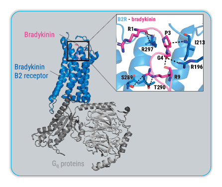
Figure 13: Cryo-electron microscopy structures show bradykinin B2 receptor binding with extensive contacts2
B2R, bradykinin receptor type 2.

Bradykinin B1 receptor, in contrast, demonstrates unique ligand specificity, preferentially binding kallidin and specifically C-terminally truncated kinin metabolite, des-Arg10-kallidin (Lys-des-Arg9-bradykinin) with highest affinity,
while intact bradykinin or des-Arg9-bradykinin display minimal or no binding affinity at this receptor subtype.14 The generation of bradykinin B1 receptorselective ligands occurs locally at inflammatory sites, making the bradykinin B1 receptor a sensor of tissue damage and a mediator of persistent inflammatory responses.14 
Bradykinin B1 and B2 receptor binding affinities for kinin peptides are shown in Figure 14. 

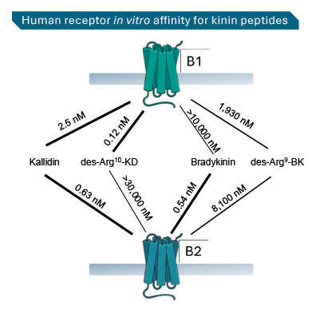
Figure 14: Bradykinin B1 and B2 receptor affinities for kinin peptides24
B1, bradykinin receptor type 1; B2, bradykinin receptor type 2; BK, bradykinin; KD, kallidin; nM, nanomole.

#### Figure 14: Bradykinin B1 and B2 receptor affinities for kinin peptides24
| Bradykinin B1 receptor | Bradykinin B2 receptor |
| ---------------------- | ---------------------- |
| Bradykinin B1 receptor exhibits an expression profile characterized by minimal or absent expression in healthy tissues. The bradykinin B1 receptor therefore follows an inducible expression pattern, with peak expression typically occurring 6-24 hours post-stimulus following exposure to inflammatory stimuli, such as IL-1β, TNF-α, IFN-γ, and bacterial  lipopolysaccharide.11-13 Expression can persist for days to weeks. | Bradykinin B2 receptor demonstrates constitutive, widespread expression across multiple tissue systems and from multiple signals under physiological conditions.5 High expression levels are found in vascular endothelium throughout the cardiovascular system, where the receptor maintains baseline vascular tone and mediates acute vasodilatory responses.25 Significant bradykinin B2 receptor expression occurs in vascular smooth muscle cells, renal tubular and glomerular cells, respiratory and gastrointestinal epithelium, and various neuronal populations.5,26 The receptor is also present in immune cells, including monocytes and tissue-resident
macrophages, enabling rapid inflammatory responses.16 |
| In chronic pathological states including diabetes, hypertension, and chronic inflammatory diseases, bradykinin B1 receptor expression becomes constitutively elevated and it is resistant to desensitization,10,18 transforming from an acute response marker to a driver of persistent pathophysiology.11-13 | Bradykinin B2 receptor signaling shows rapid onset with peak responses within 1-5 minutes, followed by efficient desensitization and receptor internalization.10,17 |

#### 4.2.5 Bradykinin B2 Receptor Expression in Systems outside the Vascular System
The bradykinin B2 receptor is constitutively and widely expressed throughout the body under normal physiological conditions. It is responsible for most of the acute effects of bradykinin, such as vasodilation, increased vascular
permeability, and pain sensation (Table 2).
| SYSTEM | Expression and Function |
| ------ | ----------------------- |
| Vascular system | Bradykinin B2 receptor is constitutively expressed on vascular cells including endothelial cells and smooth muscle cells, allowing responses to bradykinin to regulate vascular homeostasis.5 | 
| Central Nervous System | Within the central nervous system, bradykinin B2 receptor demonstrates extensive distribution throughout neuronal populations in vitro where it facilitates pain transmission (study carried out in a mouse model).27 |
| Cardiovascular System | Within the cardiovascular system, bradykinin B2 receptor expression includes cardiac myocytes for cardioprotective signaling and coronary vasculature (studies carried out in cardiomyocytes and human coronary artery endothelial cells).28,29 |
| Respiratory System | Within the respiratory system, the B2 receptor is expressed in bronchial epithelium, alveolar cells, and nasal mucosa, contributing to allergic responses (study in bronchial mucosa of allergic asthmatics).30 |
| Hepatic System | The liver demonstrates constitutive bradykinin B2 receptor expression in hepatocytes, Kupffer cells, and hepatic stellate cells, with increased expression during injury and regeneration (studies carried out in rats and mice).31,32 | 
| Gastrointestinal System | Bradykinin B2 receptor is expressed throughout the gastrointestinal tract in epithelial cells and pancreatic tissue, regulating secretion and glucose homeostasis (studies carried out in human colonic tissue and cultured cell monolayers, and in rats).33-35 |
| Reproductive System | Reproductive tissues show high bradykinin B2 receptor expression in uterine smooth muscle, prostatic epithelium and stroma, and erectile tissue (studies carried out in rat uterus, human benign and malignant prostate specimens, and human corpus cavernosum tissue).36-38 | 
| Other Systems | The B2 receptor is also found in skeletal muscle, synovial tissue, skin fibroblasts, with altered expression in inflammatory conditions, such as psoriasis (studies carried out in human synovial tissue, mice skeletal muscle cells, human subcutaneous fibroblasts, and human skin samples).39-42 |

Table 2: Expression and function of bradykinin B2 receptor according to system

#### 4.3. Cellular Signaling Pathways
The bradykinin B1 and B2 receptors activate distinct yet overlapping cellular signaling pathways (Figure 15).

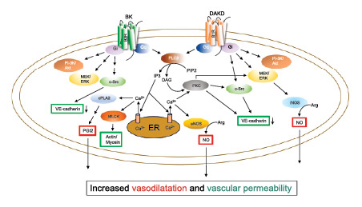
Figure 15: Kinin receptors and their signaling and regulation43
Schematic representation of the primary signaling pathways triggered by kinin stimulation of bradykinin B1 and B2 eceptors in vascular endothelium. Signals leading to vasodilatation and increased vascular permeability are indicated in red boxes and green boxes, respectively.
Akt, also known as protein kinase B or PKB; Arg, arginine; B1R, bradykinin B1 receptor; B2R, bradykinin B2 receptor; BK, bradykinin; c, cytosolic; DAKD, des-Arg10-kallidin; DAG, diacylglycerol (or diglyceride); ER, endoplasmic eticulum; ERK, extracellular regulated protein kinase; eNOS, endothelial nitric oxide synthase; G, G protein; Gi, inhibitory G protein; Gq, a heterotrimeric G protein subunit that activates phospholipase C; iNOS, inducible nitric oxide synthase; MEK,  mitogen-activated protein kinase (also known as MAP2K or MAPKK; MLCK, myosin light-chain kinase (also known as MYLK); PI-3K, phosphatidylinositol 3 kinase; PKC, protein kinase C; PGI2, prostaglandin I2; PIP2, phosphatidylinositol 4,5-bisphosphate; PLA, phospholipase A2; PLC, phospholipid C; Src, short for sarcoma, member of the Src family tyrosine kinases; VE, vascular endothelial.

Both bradykinin B1 receptor and bradykinin B2 receptor couple to Gq/11 proteins, activating phospholipase C (PLC) and hydrolyzing phosphatidylinositol 4,5-bisphosphate
2 (PIP2) to generate IP3 and DAG within seconds.10 IP3 triggers rapid intracellular calcium mobilization from endoplasmic reticulum stores, producing 5-10 fold elevations in cytosolic calcium and enabling calcium-calmodulin complex formation. DAG activates protein kinase C (PKC), which phosphorylates substrate proteins affecting gene transcription, ion channels, and cytoskeletal organization.10 The bradykinin B2 receptor also activates endothelial nitric oxide synthase (eNOS) and
phospholipase A2 (PLA2) which induce release of nitric oxide (NO) and prostaglandins (PGIs). NO and PGIs induce vascular smooth muscle cell relaxation and blood vessel
vasodilation.10,43

Both receptors stimulate phospholipase A2, liberating arachidonic acid for eicosanoid synthesis through cyclooxygenase, lipoxygenase, and cytochrome P450 pathways, producing prostaglandins, leukotrienes, and epoxyeicosatrienoic acids (EETs) respectively.45 Mitogenactivated protein kinase (MAPK) cascade activation (ERK1/2, p38, JNK) stimulates transcription factors (AP-1, NF-κB, CREB) for inflammatory mediator production and long-term cellular responses.7,46

IP3 and DAG
IP3 (inositol trisphosphate) and DAG (diacylglycerol) are intracellular “second messenger” molecules that transmit signals within a cell after a “first messenger” (e.g., hormone) binds to a cell surface receptor.44

### Summary
• Overview:
• Bradykinin B1 and B2 receptors are GPCRs activated by bradykinin, kallidin and their active metabolites.1-3
• Expression patterns and roles
• Bradykinin B1 receptor:
• Generally absent or very low in healthy tissues, but upregulated in inflammatory conditions.2,7,10,11-13
• Mediates long-term/chronic inflammation and persistent pain, and may be a therapeutic target for chronic pain, diabetes, and cancer.10-13
• Bradykinin B2 receptor:
• Constitutively and ubiquitously expressed in most healthy tissues, with expression unchanged by inflammation.2,7,10
• Mediates acute inflammatory responses, vasodilation, smooth muscle contraction, and initial pain signaling, and is a therapeutic target for acute conditions like hereditary angioedema.10,16
• Molecular Structure and Chromosomal Organization • Bradykinin B1 and B2 receptors are encoded on adjacent loci of human chromosome 14 (BDKRB1 and BDKRB2), sharing 32% sequence identity.2,7 
• Tissue-Specific Receptor and Functional Significance
• Genetic variations in BDKRB1 and BDKRB2 exist for bradykinin B1 and B2 receptors; however, their functional implications are not well understood.19,20
• In vitro studies indicate functional heterodimerization between bradykinin B1 and B2 receptors, and between bradykinin B2 receptor and ACE, but the existence and biological roles of such complexes in vivo remain unknown.22,23
• Ligand Specificity and Binding Characteristics
• Cryo-EM studies have defined the bradykinin B2 receptor binding pocket and activation helices for bradykinin and kallidin, which may inform drug discovery.2
• The bradykinin B1 receptor preferentially binds kallidin and des-Arg10-kallidin (Lys-des-Arg9-bradykinin) with highest affinity. Intact bradykinin or des-Arg9- bradykinin display minimal or no binding affinity at this receptor subtype.14
• In contrast, the bradykinin B2 receptor binds intact kinins with high affinity.4
• Bradykinin B2 Receptor Expression in Different Systems 
• Under normal physiological conditions, the bradykinin B2 receptor is constitutively and widely expressed throughout the body including in the central nervous system, cardiovascular, respiratory, hepatic, gastrointestinal and reproductive systems.27-38
• Bradykinin Receptor Signaling
• Bradykinin receptors activate Gq/11–PLC signaling, raising intracellular calcium and PKC activity, while inducing NO and PGI release that drive vasodilation.10,43 

### References
1. Prado GN, Taylor L, Zhou X, et al. Mechanisms regulating the expression, self-maintenance, and signaling-function of the bradykinin B2 and B1 receptors. J Cell Physiol. 2002;193(3):275-286.
2. Shen J, Zhang D, Fu Y, et al. Cryo-EM structures of human bradykinin receptor-Gq proteins complexes. Nat Commun. 2022;13(1):714.
3. Menke JG, Borkowski JA, Bierilo KK, et al. Expression cloning of a human B1 bradykinin receptor. J Biol Chem. 1994;269(34):21583-21586.
4. Yin Y-L, Ye C, Zhou F, et al. Molecular basis for kinin selectivity and activation of the human bradykinin receptors. Nat Struct Mol Biol. 2021;28(9):755-761.
5. Lau J, Rousseau J, Kwon D, et al. A Systematic Review of Molecular Imaging Agents Targeting Bradykinin B1 and B2 Receptors. Pharmaceuticals. 2020;13(8):199.
6. Stewart JM. Bradykinin antagonists: discovery and development. Peptides. 2004;25:527-532.
7. Marceau F, Bachelard H, Bouthillier J, et al. Bradykinin receptors: Agonists, antagonists,expression, signaling, and adaptation to sustained stimulation. Int Immunopharmacol.2020;82:106305.
8. Sriram K, Insel PA. G Protein-Coupled Receptors as Targets for Approved Drugs: How Many Targets and How Many Drugs? Mol Pharmacol. 2018;93(4):251-258.
9. Lorente JS, Sokolov AV, Ferguson G, et al. GPCR drug discovery: new agents, targets and indications. Nat Rev Drug Discov. 2025;24(6):458-479.
10. Leeb-Lundberg LM, Marceau F, Müller-Esterl W, et al. International union of pharmacology. XLV. Classification of the kinin receptor family: from molecular mechanisms to pathophysiological consequences. Pharmacol Rev. 2005;57(1):27-77.
11. Dias JP, Talbot S, Sénécal J, et al. Kinin B1 receptor enhances the oxidative stress in a rat model of insulin resistance: outcome in hypertension, allodynia and metabolic complications. PLoS One. 2010;5(9):e12622.
12. Passos GF, Fernandes ES, Campos MM, et al. Kinin B1 receptor up-regulation after lipopolysaccharide administration: role of proinflammatory cytokines and neutrophil influx. J Immunol. 2004;172(3):1839-1847.
13. Koumbadinga GA, Désormeaux A, Adam A, Marceau F. Effect of interferon-γ on inflammatory cytokine-induced bradykinin B1 receptor expression in human vascular cells. Eur J Pharmacol. 2010;647(1-3):117-125.
14. Marceau F, Bachelard H. A Robust Bioassay of the Human Bradykinin B2 Receptor That Extends Molecular and Cellular Studies: The Isolated Umbilical Vein. Pharmaceuticals (Basel). 2021;14(3):177.
15. Schanstra JP, Bataillé E, Marin Castaño ME, et al. The B1-agonist [des-Arg10]-kallidin activates transcription factor NF-kappaB and induces homologous upregulation of the bradykinin B1-receptor in cultured human lung fibroblasts. J Clin Invest. 1998;101(10):2080-2091.
16. Monteiro AC, Schmitz V, Morrot A, et al. Bradykinin B2 Receptors of dendritic cells, acting as sensors of kinins proteolytically released by Trypanosoma cruzi, are critical for the development of protective type-1 responses. PLoS Pathog. 2007;3(11):e185.
17. Blaukat A, Pizard A, Breit A, et al. Determination of bradykinin B2 receptor in vivo phosphorylation sites and their role in receptor function. J Biol Chem. 2001;276(44):40431-40440.
18. Sabourin T, Bastien L, Bachvarov DR, Marceau F. Agonist-induced translocation of the kinin B(1) receptor to caveolae-related rafts. Mol Pharmacol. 2002;61(3):546-553.
19. Cui J, Melista E, Chazaro I, et al. Sequence variation of bradykinin receptors B1 and B2 and association with hypertension. J Hypertens. 2005;23(1):55-62.
20. Rouhiainen A, Kulesskaya N, Mennesson M, et al. The bradykinin system in stress and anxiety in humans and mice. Sci Rep. 2019;9(1):19437.
21. Cheah FY, Baltic S, Temple SE, et al. Novel kinin B₁ receptor splice variant and 5’UTR regulatory elements are responsible for cell specific B₁ receptor expression. PLoS One. 2014;9(1):e87175.
22. Kang DS, Ryberg K, Mörgelin M, Leeb-Lundberg LM. Spontaneous formation of a proteolytic B1 and B2 bradykinin receptor complex with enhanced signaling capacity. J Biol Chem.2004;279(21):22102-22107.
23. Chen Z, Deddish PA, Minshall RD, et al. Human ACE and bradykinin B2 receptors form a complex at the plasma membrane. FASEB J. 2006;20(13):2261-2270.
24. Riedl MA, et al. The Roles and Relevance of Bradykinin and its B2 Receptor in Health and Disease. In preparation, 2025.
25. Liao JK, Homcy CJ. The G proteins of the G alpha i and G alpha q family couple the bradykinin receptor to the release of endothelium-derived relaxing factor. J Clin Invest. 1993;92(5):2168-2172.
26. Yi J, Bertels Z, Del Rosario JS, et al. Bradykinin receptor expression and bradykinin-mediated sensitization of human sensory neurons. Pain. 2024;165(1):202-215.
27. Quintão NLM, Rocha LW, da Silva GF, et al. The kinin B1 and B2 receptors and TNFR1/p55 axis on neuropathic pain in the mouse brachial plexus. Inflammopharmacology. 2019;27(3):573-586.
28. Dong R, Xu X, Li G, et al. Bradykinin inhibits oxidative stress-induced cardiomyocytes senescence via regulating redox state. PLoS One. 2013;8(10):e77034.
29. Liesmaa I, Kokkonen JO, Kovanen PT, Lindstedt KA. Lovastatin induces the expression of bradykinin type 2 receptors in cultured human coronary artery endothelial cells. J Mol Cell Cardiol. 2007;43(5):593-600.
30. Ricciardolo FL, Petecchia L, Sorbello V, et al. Bradykinin B2 receptor expression in the bronchial mucosa of allergic asthmatics: the role of NF-kB. Clin Exp Allergy. 2016;46(3):428-438.
31. Sancho-Bru P, Bataller R, Fernandez-Varo G, et al. Bradykinin attenuates hepatocellular damage and fibrosis in rats with chronic liver injury. Gastroenterology. 2007;133(6):2019-2028.
32. Zhang J, Li N, Yang L, et al. Bradykinin contributes to immune liver injury via B2R receptormediated pathways in trichloroethylene sensitized mice: A role in Kupffer cell activation. Toxicology. 2019;415:37-48.
33. Baird AW, Skelly MM, O’Donoghue DP, et al. Bradykinin regulates human colonic ion transport in vitro. Br J Pharmacol. 2008;155(4):558-566.
34. Yang C, Chao J, Hsu WH. The effect of bradykinin on secretion of insulin, glucagon, and somatostatin from the perfused rat pancreas. Metabolism. 1997;46(10) :1113-1115.
35. Ewert S, Johansson B, Holm M, et al. The bradykinin BK2 receptor mediates angiotensin II receptor type 2 stimulated rat duodenal mucosal alkaline secretion. BMC Physiol. 2003;3:1.
36. Murone C, Chai SY, Müller-Esterl W, et al. Localization of bradykinin B2 receptors in the endometrium and myometrium of rat uterus and the effects of estrogen and progesterone. Endocrinology. 1999;140(7):3372-3382.
37. Taub JS, Guo R, Leeb-Lundberg LM, et al. Bradykinin receptor subtype 1 expression and function in prostate cancer. Cancer Res. 2003;63(9):2037-2041.
38. Kimoto Y, Kessler R, Constantinou CE. Endothelium dependent relaxation of human corpus cavernosum by bradykinin. J Urol. 1990;144(4):1015-1017.
39. Cassim B, Naidoo S, Ramsaroop R, Bhoola KD. Immunolocalization of bradykinin receptors on human synovial tissue. Immunopharmacology. 1997;36(2-3):121-125.
40. Figueroa CD, Dietze G, Müller-Esterl W. Immunolocalization of bradykinin B2 receptors on skeletal muscle cells. Diabetes. 1996;45 Suppl 1:S24-S28.
41. Pinheiro AR, Paramos-de-Carvalho D, Certal M, et al. Bradykinin-induced Ca2+ signaling in human subcutaneous fibroblasts involves ATP release via hemichannels leading to P2Y12 receptors activation. Cell Commun Signal. 2013;11:70.
42. Liu H, Zhang M, Dong X, et al. Aberrant expression of bradykinin b2 receptor in the epidermis of patients with psoriasis vulgaris. Indian J Dermatol Venereol Leprol. 2019;85(6):653-655.
43. Leeb-Lundberg LM. Kinin receptors and their signaling and regulation. Chapter 3. 2025.
44. Ahmed R and Dalziel JE. G Protein-Coupled Receptors in Taste Physiology and Pharmacology. Front Pharmacol. 2020;11:587664.
45. Campbell WB, Fleming I. Epoxyeicosatrienoic acids and endothelium-dependent responses. Pflugers Arch. 2010;459(6):881-895.
46. Leeb-Lundberg LM. Bradykinin specificity and signaling at GPR100 and B2 kinin receptors. B J Pharmacol. 2004;143:931–932.

## 05 Bradykinin’s Physiological Roles
### INTRODUCTION 
Welcome to Section 5!
This section focuses on the physiological roles of bradykinin, describing how the peptide acts as a key mediator linking vascular permeability,
immune activation, and nociceptive signaling. Acting through bradykinin B2 receptors and bradykinin B1 receptors [see Module 1 Section 4], bradykinin plays a crucial role in acute inflammatory responses and contributes to pain sensitization across peripheral and central pathways.

Understanding bradykinin’s physiological roles enables you to understand why, in situations when bradykinin regulation is altered such as AE-BK, deucrictibant – a bradykinin B2 receptor antagonist – may be a viable therapeutic approach.

After completing this section, you will be able to:
• Describe how bradykinin regulates vascular permeability
• Explain cytokine and oxidative pathways that amplify bradykinin-driven inflammation
• Discover how bradykinin impacts leukocyte recruitment
• Identify how bradykinin contributes to pain signaling through peripheral and central mechanisms
• Recognize interactions between bradykinin, the complement system, and the coagulation system to understand its role in the development of inflammation and pain
• Relate bradykinin-mediated mechanisms to clinical conditions, such as HAE

### 5.1 Overview
Bradykinin is a potent, short-lived vasoactive peptide that plays important roles in the regulation of physiological processes and is considered a key regulator of vascular tone, acute inflammation, bronchoconstriction, and pain, primarily via bradykinin B2 receptors, which are constitutively expressed on endothelial cells, smooth muscle cells, and various immune cells.1-6 Bradykinin serves as a classic example of a protein autacoid.3

What is an autacoid?
Autacoids are locally produced signaling molecules that regulate nearby tissue function.7

Bradykinin has various biological actions [Figure 16]:
• Vasodilation and permeability: Bradykinin acts on endothelial cells, causing rapid nitric oxide (NO) release and prostacyclin synthesis, resulting in smooth muscle relaxation and marked vasodilation1,3 
• Edema formation: By increasing vascular permeability, bradykinin enables plasma extravasation, contributing centrally to the angioedema seen in hereditary angioedema (HAE) and acquired angioedema due to C1 inhibitor deficiency (AAE-C1INH)8 [see Module 2 Section 1 for a detailed description of types of AE-BK]
• Pain and inflammation: As one of the most potent endogenous algogenic (pain-producing) agents, bradykinin sensitizes and directly excites ociceptors and is heavily implicated in the pathophysiology of inflammatory pain1,3
• Regulatory effects: Through actions on renal and vascular tissues and interplay with the renin-angiotensin system, bradykinin is one of the several factors involved in regulation of blood pressure and cardiac remodeling1,3,4,9

Understanding the physiological function of bradykinin is essential because in certain human pathologies - such as bradykinin-mediated angioedema (AE-BK), where plasma kallikrein is dysregulated - excessive bradykinin production triggers signals in blood vessel linings. This leads to noticeable swelling (non-pitting edema) of the skin and/or mucous membranes. The resulting pain and loss of function depend on which tissue is affected.

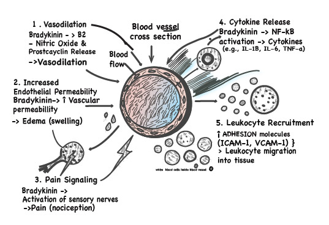
Figure 16. Cartoon of various biological actions of bradykinin
ICAM-1, Intercellular Adhesion Molecule-1; IL, interleukin; NF, nuclear factor; VCAM-1, Vascular Cell Adhesion Molecule-1.

### 5.2 Bradykinin as a Trigger for AE-BK and Its Effect on Endothelial Permeability and Vasculature
Bradykinin serves as a key mediator of angioedema by increasing endothelial permeability and prostacyclin synthesis. 
By binding to bradykinin B2 receptors on endothelial cells, bradykinin triggers intracellular signaling cascades, including calcium release. These cascades lead to the production of nitric oxide (NO) and prostacyclin, as well as the activation of phospholipase A₂ and protein kinase C, ultimately resulting in smooth muscle relaxation, decreased vascular tone, and vasodilation [Figure 17].1,3,10 
Bradykinin also increases the cellular components of inflammation, including the release of pain-inducing mediators, such as prostaglandins and substance P. These effects contribute to the classical inflammatory symptoms of redness, swelling, heat, and pain. Additionally, bradykinin stimulates the production of pro-inflammatory cytokines and chemokines.1-6 These effects, however, are considered secondary in terms of clinical relevance to the vasodilation, edema, and swelling described above, which can be life-threatening.11

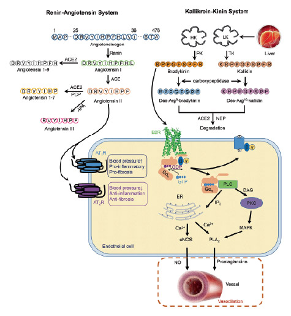
Figure 17: Bradykinin’s vascular cascade, involving the renin-angiotensin and kallikrein-kinin systems10
ACE, angiotensin-converting enzyme; APA aminopeptidase A, AT-R, angiotensin receptor; B2R, bradykinin receptor type 2; Ca2+, calcium; DAG, diacyl glycerol, eNOS, endothelial nitric oxide synthase; ER, endoplasmic reticulum; GDP, guanosine diphosphate; GTP, guanosine triphosphate; HK, high-molecular-weight kininogen; IP3, inositol 1,4,5-trisphosphate; LK, low-molecular-weight kininogen; MAPK mitogen-activated protein kinase; NEP, neutral endopeptidase; NO, nitric oxide; PCP, prolylcarboxypeptidase (angiotensinase C); PK, plasma kallikrein, PKC, protein kinase C, PLA2, phospholipase A2; PLC, phospholipase C; TK, tissue kallikrein.

Furthermore, bradykinin activates cytochrome P450 epoxygenases in endothelial cells, producing EETs which hyperpolarize and relax vascular smooth muscle via potassium channel activation.17 EETs provide alternative or complementary vasodilatory signals, most prominent in small arteries and arterioles that are primary determinants of peripheral vascular resistance and blood pressure control.17
In addition, bradykinin induces hyperpolarization via activation of calcium-sensitive potassium channels in endothelial cells. These signals spread through gap junctions, synchronizing relaxation of vascular segments.14
Concurrently, bradykinin upregulates the expression of adhesion molecules such as ICAM-1 and VCAM-1 on endothelial surfaces, enhancing leukocyte rolling, adhesion, and transmigration into inflamed sites. Through these combined effects, bradykinin acts as a crucial mediator of the vascular changes that characterize acute inflammatory responses.12,13,18,19

ICAM-1 and VCAM-1
Intercellular Adhesion Molecule-1 (ICAM-1) and Vascular Cell Adhesion Molecule-1 (VCAM-1) are cell surface adhesion molecules that are crucial for the immune system by helping white blood cells stick to and move through the walls of blood vessels. They are both part of the immunoglobulin superfamily and are involved in inflammation and immune responses, but they have different specificities: ICAM-1 is involved in a broader range of immune cell interactions, while VCAM-1 is more specifically involved in the adhesion of lymphocytes, monocytes, eosinophils, and basophils to the vascular endothelium.20

Bradykinin-induced cascade activation promotes cytoskeletal reorganization and induces vascular endothelial cadherin (VE-cadherin) phosphorylation and internalization, resulting in the disassembly of intercellular junctions on the endothelial cells, e.g., adherens junctions.
This increases vascular permeability and facilitates plasma protein leakage into the surrounding tissues.12-15

Nitric Oxide (NO) and prostacyclin
NO diffuses to vascular smooth muscle cells, thereby driving relaxation. In addition, NO modulates vascular permeability and participates in endothelial junction dynamics. The disruption of junction proteins increases cellular permeability.12-15

Prostacyclin release activates cAMP-mediated signaling for vasodilation, and inhibits platelet aggregation, contributing to vascular protection, especially when NO mechanisms are impaired or in inflammation.14

Adherens junctions
Adherens junctions play an important role in regulating vascular homeostasis and limiting paracellular transport. Adherens junctions control endothelial permeability and maintain vascular integrity via vascular-endothelial cadherin (VE-cadherin) molecules.16

### Bradykinin Effect on Cytokines
Bradykinin signaling exerts significant influence on cytokine production, contributing to the amplification of inflammatory responses. It binds to its bradykinin B2 receptors on various cell types, including endothelial cells, smooth muscle cells, macrophages, and fibroblasts. This activates signaling pathways, such as NF-κB and MAPK. This activation stimulates the synthesis and release of pro-inflammatory cytokines, including interleukin-1β (IL-1β), interleukin-6 (IL-6), and tumor necrosis factor-alpha (TNF-α). The cytokines further propagate inflammation and recruit immune cells to the affected tissue.13,18,21-26

NF-κB and MAPK
NF-κB (Nuclear Factor kappa-light-chain-enhancer of activated B cells) is a family of proteins that act as a transcription factor to control the expression of genes involved in cell growth, survival, inflammation, and immune response. In its inactive state, NF-κB is held in the cytoplasm by inhibitors called IκB proteins. When a cell receives an external signal, IκB is degraded, and the released NF-κB moves to the nucleus to activate the transcription of target genes.27
MAPK (Mitogen-Activated Protein Kinase) is a family of enzymes that are critical for relaying signals from the cell’s exterior to its interior. This signaling pathway regulates a wide range of cellular processes, including cell division, growth, survival, and differentiation, and is activated by external stimuli like hormones, stress, and cytokines. Because of their central role, dysregulation of the MAPK pathway is linked to many diseases.28

### 5.4 Organ-Specific Permeability: Lung and Blood–Brain Barrier
Within the respiratory system, the bradykinin B2 receptor is expressed in bronchial epithelium, alveolar cells, and nasal mucosa, contributing to allergic responses.29 In the lung, bradykinin-induced permeability can/may contribute to lifethreatening edema when coupled with intense cytokine and complement activity, as in the case of severe COVID-19 disease.30
At the blood-brain barrier (BBB), bradykinin increases permeability via its B2 receptor. The mechanism involves calcium signaling, PLA2, arachidonic acid metabolites, and reactive oxygen species (ROS). Inducible bradykinin B1 receptor is activated under ischemia/inflammation, further augmenting tight junction disruption and cytokine production, worsening edema and neuroinflammation.13,31,32 These principles extend to stroke, where bradykinin B2 receptor antagonism reduces permeability and neutrophil recruitment, illustrating that inhibition of kinin-induced endothelial modulation can be protective when overactivation of bradykinin signaling drives pathology.33 In the cerebral vascular beds, bradykinin drives vasodilation and permeability via NO and endothelium-derived hyperpolarizing factor, EDHF, impacting perfusion and risk of edema (e.g.,in stroke).14

COVID-19: The Bradykinin Storm Hypothesis
Endothelial injury and angiotensin-converting enzyme 2 (ACE2) perturbation during SARS-CoV-2 infection can tilt the balance toward excess bradykinin signaling and contact–complement activation, consistent with the “bradykinin storm” hypothesis of pulmonary microvascular hyperpermeability and inflammatory lung edema in severe COVID-19, alongside contributions from other vasoactive peptides (e.g., substance P, neurotensin) (Figure
18).30,34-36

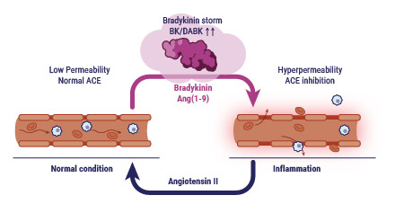
Figure 18: Bradykinin increases with ACE inhibition, driving hyperpermeability.30
System-level studies and mechanistic reviews support a model in which bradykinin acts as a putative amplifier of cytokine production, barrier leak, and leukocyte recruitment, aligning with clinical observations of diffuse alveolar damage and vascular inflammation in severe cases.30 On this basis, therapies that target endothelial permeability, complement, or kallikrein–kinin system activation have been proposed as adjuncts to conventional antiviral and anti-inflammatory regimens in fulminant disease.37-39
ACE, angiotensin-converting enzyme; Ang(1-9), angiotensin-(1-9); BK, bradykinin; DABK, des-Arg⁹-bradykinin.

### Peripheral Nociception, Central Sensitization and Bradykinin B1 Receptor Pathways
Other physiological roles of bradykinin include:
|  |  |
| ---- | ---- |
| Peripheral nociception | Bradykinin acts directly on peripheral nociceptor terminals to lower pain thresholds via bradykinin B2 receptor-mediated pathways and, in inflamed states, via bradykinin B1 receptor-mediated pathways. These pathways couple G protein-coupled receptor signaling to transient receptor potential (TRP)-channel sensitization and increase neuronal membrane excitability [Figure 19].40-42 Through biochemical pathways, bradykinin substantially increases heat and chemical sensitivity during inflammation.42-46 Bradykinin also mediates other pain pathways, such as protein kinase C (PKC) and diacylglycerol (DAG), thereby broadening the repertoire of peripheral thermal and chemical hyperalgesia.47-51 |
| Central sensitization | With extensive bradykinin B2 receptor distribution throughout the neuronal system in vitro, particularly enriched in dorsal root ganglia nociceptors and spinal cord dorsal horn neurons, bradykinin potentiates synaptic transmission, increasing miniature excitatory postsynaptic current (mEPSC) frequency and facilitating central sensitization.52-54 The bradykinin B1 receptor is also present in brain microvascular endothelial cells, modulating blood-brain barrier permeability, and in neural stem cells where it influences neurogenesis in vitro.55 This central sensitization effect is attenuated in experimental models with bradykinin B2 receptor deficiency.53 PKC and TRP pathways link to bradykinin signaling, further influencing chronic pain output.56,57|
| Bradykinin B1 receptor in chronic inflammatory and neuropathic pain | Bradykinin B1 receptor expression increases in a proinflammatory cytokine environment and after nerve injury.18,58 Bradykinin B1 receptor activation promotes sustained hyperexcitability. This positions bradykinin B1 receptor as a potential therapeutic target in chronic pain and neuroinflammatory states.18,59-61 |

What is peripheral nociception?
Peripheral nociception is the initial process where specialized nerve endings called nociceptors in the peripheral nervous system detect potentially damaging stimuli, such as heat, pressure, or chemical irritants.63

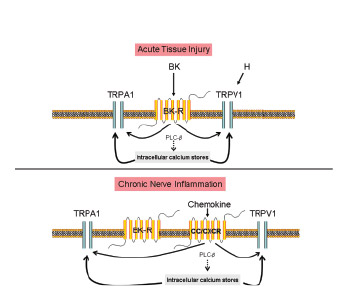
Figure 19: Crosstalk among chemokine receptors, bradykinin, and transient receptor potential channels (TRP).62
BK, bradykinin; BK-R, bradykinin receptor; CC/CXCR, chemokine receptor; PLC, phospholipase C; TRP, transient receptor potential channel.

### Summary
• Overview: Bradykinin is a potent mediator of vasodilation, vascular permeability, cellular inflammation and pain, that acts primarily through bradykinin B2 receptors.1,3,10
• Endothelial effects:
• Changes vascular tone and vasodilation: This occurs via binding to B2 receptors on endothelial cells triggering calcium-dependent pathways that ultimately produce NO and prostacyclin, and via bradykinin-induced cascade activation leading to cytoskeletal reorganization.10,12-15
• Initiates production of EETs in endothelial cells: These hyperpolarize and relax vascular smooth muscle via potassium channel activation.17
• Enhances leukocyte rolling, adhesion, and transmigration into inflamed sites, via upregulation of endothelial adhesion molecules.12,13,18,19
• Inflammatory signaling and cytokine interactions: Amplifies and sustains pain signals and the inflammatory cascade:
• Enhances the release of prostaglandins, substance P, and pro-inflammatory cytokines and chemokines.1-6,13,18,22,23
• Organ-specific effects:
• Lung: Excessive bradykinin generation promotes microvascular leak and pulmonary edema in acute lung /respiratory inflammation, and COVID-19.30,37
• Blood–brain barrier: Bradykinin and des-Arg kinins increase BBB permeability via calcium signaling, PLA2, arachidonic acid metabolites, and ROS, contributing to cerebral edema and neuroinflammation.13,31,32,33
• Stroke and ischemia–reperfusion: Bradykinin B2 receptor antagonists reduce permeability and leukocyte recruitment.33
• Pain mechanisms – peripheral nociception:
• Bradykinin lowers pain thresholds by coupling GPCR signaling to transient receptor potential (TRP)-channel sensitization through PKC and DAG pathways.40-42
• Bradykinin B2 receptor activation enhances heat and chemical sensitivity, while bradykinin B1 receptor supports persistent pain in inflamed tissue.40-42
• Interaction with prostaglandins (PGE2, EP4) and neuropeptides (CGRP) amplifies nociceptor excitability.45,50,51
• Central sensitization and disease-related chronic pain:
• In vitro studies of isolated neurons from the spinal dorsal horn demonstrated that bradykinin enhances glutamatergic transmission, increasing synaptic strength and pain signaling.53,54
• Bradykinin B2 receptor mediates acute facilitation, while bradykinin B1 receptor supports sustained sensitization via non-desensitizing signaling and cytokine reinforcement.18,56-61
• Elevated bradykinin B1 receptor expression in chronic pain, fibrosis, and neuroinflammation makes it a promising therapeutic target.60,61

### References
1. Stewart JM. Bradykinin antagonists: discovery and development. Peptides. 2004;25:527-532.
2. Hawgood BJ. Snake venom, bradykinin and the rise of autopharmacology. Toxicon. 1997;35(11):1569-1580.
3. Golias Ch, Charalabopoulos A, Stagikas D, et al. The kinin system--bradykinin: biological effects and clinical implications. Multiple role of the kinin system--bradykinin. Hippokratia.2007;11(3):124-128.
4. Prado GN, Taylor L, Zhou X, et al. Mechanisms regulating the expression, self-maintenance, and signaling-function of the bradykinin B2 and B1 receptors. J Cell Physiol. 2002;193(3):275-286.
5. Downey P. Profile of Sérgio Ferreira. Proc Natl Acad Sci U S A. 2008;105(49):19035-19037.
6. Marceau F, Bachelard H, Bouthillier J, et al. Bradykinin receptors: Agonists, antagonists, expression, signaling, and adaptation to sustained stimulation. Int Immunopharmacol.2020;82:106305.
7. Keppel Hesselink JM. Fundamentals of and Critical Issues in Lipid Autacoid Medicine: A Review. Pain Ther. 2017;6(2):153-164.
8. Jayasinghe M, Caldera D, Prathiraja O, et al. A Comprehensive Review of Bradykinin-Induced Angioedema Versus Histamine-Induced Angioedema in the Emergency Department. Cureus.2022;14(11):e32075.
9. Sriram K, Insel PA. G Protein-Coupled Receptors as Targets for Approved Drugs: How Many Targets and How Many Drugs? Mol Pharmacol. 2018;93(4):251-258.
10. Shen J-K, Zhang H-T. Function and structure of bradykinin receptor 2 for drug discovery. Acta Pharmacologica Sinica. 2023;44:489–498.
11. Farkas H. Management of upper airway edema caused by hereditary angioedema. AACI.2010;6:19:1-8.
12. Claesson-Welsh L, Dejana E, McDonald DM. Permeability of the Endothelial Barrier: Identifying and Reconciling Controversies. Trends Mol Med. 2021;27(4):314-331.
13. Mugisho OO, Robilliard LD, Nicholson LFB, et al. Bradykinin receptor-1 activation induces inflammation and increases the permeability of human brain microvascular endothelial cells.Cell Biol Int. 2020;44(1):343-351.
14. Leeb-Lundberg LM, Marceau F, Müller-Esterl W, et al. International union of pharmacology. XLV.Classification of the kinin receptor family: from molecular mechanisms to pathophysiological consequences. Pharmacol Rev. 2005;57(1):27-77.
15. Debreczeni ML, Németh Z, Kajdácsi E, et al. Molecular Dambusters: What Is Behind Hyperpermeability in Bradykinin-Mediated Angioedema? Clin Rev Allergy Immunol.2021;60(3):318-347.
16. Dejana E, Orsenigo F. Endothelial adherens junctions at a glance. J Cell Sci. 2013;126(Pt 12):2545-2549.
17. Campbell WB, Fleming I. Epoxyeicosatrienoic acids and endothelium-dependent responses. Pflugers Arch. 2010;459(6):881-895.
18. Bekassy Z, Lopatko Fagerström I, Bader M, Karpman D. Crosstalk between the reninangiotensin, complement and kallikrein-kinin systems in inflammation. Nat Rev Immunol.2022;22(7):411-428.
19. Ou Z, Dolmatova E, Lassègue B, Griendling KK. β1- and β2-integrins: central players in regulating vascular permeability and leukocyte recruitment during acute inflammation. Am J Physiol Heart Circ Physiol. 2021;320(2):H734-H739.
20. Singh V, et al. ICAM-1 and VCAM-1: Gatekeepers in various inflammatory and cardiovascular disorders. Clin Chim Acta. 2023:548:117487.
21. Yang L, Mäki-Petäjä K, Cheriyan J, et al. The role of epoxyeicosatrienoic acids in the cardiovascular system. Br J Clin Pharmacol. 2015;80(1):28-44.
22. Ferreira SH, Lorenzetti BB, Poole S. Bradykinin initiates cytokine-mediated inflammatory hyperalgesia. Br J Pharmacol. 1993;110(3):1227-1231.
23. Terzuoli E, Meini S, Cucchi P, et al. Antagonism of bradykinin B2 receptor prevents inflammatory responses in human endothelial cells by quenching the NF-kB pathway activation. PLoS One. 2014;9(1):e84358.
24. Meuren LM, Prestes EB, Papa MP, et al. Infection of Endothelial Cells by Dengue Virus Induces ROS Production by Different Sources Affecting Virus Replication, Cellular Activation, Death and Vascular Permeability. Front Immunol. 2022;13:810376.
25. Garland CJ, Dora KA. Endothelium-Dependent Hyperpolarization: The Evolution of Myoendothelial Microdomains. J Cardiovasc Pharmacol. 2021;78(Suppl 6):S3-S12.
26. Ricciotti E, FitzGerald GA. Prostaglandins and inflammation. Arterioscler Thromb Vasc Biol.2011;31(5):986-1000.
27. Oeckinghaus A, Ghosh S. The NF-κB Family of Transcription Factors and Its Regulation. Cold Spring Harb Perspect Biol. 2009;1(4):a000034.
28. Moens U, Kostenko S, Sveinbjørnsson B. The Role of Mitogen-Activated Protein Kinase-Activated Protein Kinases (MAPKAPKs) in Inflammation. Genes (Basel). 2013;4(2):101–133.
29. Ricciardolo FL, Petecchia L, Sorbello V, et al. Bradykinin B2 receptor expression in the bronchial mucosa of allergic asthmatics: the role of NF-kB. Clin Exp Allergy. 2016;46(3):428-438.
30. Garvin MR, Alvarez C, Miller JI, et al. A mechanistic model and therapeutic interventions for COVID-19 involving a RAS-mediated bradykinin storm. Elife. 2020;9:e59177.
31. Sarker MH, Hu DE, Fraser PA. Acute effects of bradykinin on cerebral microvascular permeability in the anaesthetized rat. J Physiol. 2000;528 Pt 1(Pt 1):177-187.
32. Easton AS, Abbott NJ. Bradykinin increases permeability by calcium and 5-lipoxygenase in the ECV304/C6 cell culture model of the blood-brain barrier. Brain Res. 2002;953(1-2):157-169.
33. Souza DG, Pinho V, Pesquero JL, et al. Role of the bradykinin B2 receptor for the local and systemic inflammatory response that follows severe reperfusion injury. Br J Pharmacol.2003;139(1):129-139.
34. Karamyan VT. Between two storms, vasoactive peptides or bradykinin underlie severity of COVID-19? Physiol Rep. 2021;9(5):e14796.
35. Afzali B, Noris M, Lambrecht BN, Kemper C. The state of complement in COVID-19. Nat Rev Immunol. 2022;22(2):77-84.
36. Sodhi CP, Wohlford-Lenane C, Yamaguchi Y, et al. Attenuation of pulmonary ACE2 activity impairs inactivation of des-Arg9 bradykinin/BKB1R axis and facilitates LPS-induced neutrophil infiltration. Am J Physiol Lung Cell Mol Physiol. 2018;314(1):L17-L31.
37. Morita M, Yoneda A, Tokunoh N, et al. Upregulation of Robo4 expression by SMAD signaling suppresses vascular permeability and mortality in endotoxemia and COVID-19 models. Proc Natl Acad Sci U S A. 2023;120(3):e2213317120.
38. Malchair P, Giol J, García V, et al. Three-Day Icatibant on Top of Standard Care in Patients With Coronavirus Disease 2019 Pneumonia: A Randomized, Open-Label, Phase 2, Proof-of-Concept Trial. Clin Infect Dis. 2023;76(10):1784-1792.
39. Vlaar APJ, Witzenrath M, van Paassen P, et al. Anti-C5a antibody (vilobelimab) therapy for critically ill, invasively mechanically ventilated patients with COVID-19 (PANAMO): a multicentre, double-blind, randomised, placebo-controlled, phase 3 trial. Lancet Respir Med.2022;10(12):1137-1146.
40. Schumacher MA. Transient receptor potential channels in pain and inflammation: therapeutic opportunities. Pain Pract. 2010;10(3):185-200.
41. Manning DC, Raja SN, Meyer RA, Campbell JN. Pain and hyperalgesia after intradermal injection of bradykinin in humans. Clin Pharmacol Ther. 1991;50(6):721-729.
42. Mathivanan S, Devesa I, Changeux JP, Ferrer-Montiel A. Bradykinin Induces TRPV1 Exocytotic Recruitment in Peptidergic Nociceptors. Front Pharmacol. 2016;7:178.
43. Sikand P, Premkumar LS. Potentiation of glutamatergic synaptic transmission by protein kinase C-mediated sensitization of TRPV1 at the first sensory synapse. J Physiol. 2007;581(Pt 2):631-647.
44. Devesa I, Ferrándiz-Huertas C, Mathivanan S, et al. αCGRP is essential for algesic exocytotic mobilization of TRPV1 channels in peptidergic nociceptors. Proc Natl Acad Sci U S A.2014;111(51):18345-18350.
45. Zhang X, Li L, McNaughton PA. Proinflammatory mediators modulate the heat-activated ion channel TRPV1 via the scaffolding protein AKAP79/150. Neuron. 2008;59(3):450-461.
46. Bhave G, Hu HJ, Glauner KS, et al. Protein kinase C phosphorylation sensitizes but does not activate the capsaicin receptor transient receptor potential vanilloid 1 (TRPV1). Proc Natl Acad Sci U S A. 2003;100(21):12480-12485.
47. Bandell M, Story GM, Hwang SW, et al. Noxious cold ion channel TRPA1 is activated by pungent compounds and bradykinin. Neuron. 2004;41(6):849-857.
48. Behrendt M, Solinski HJ, Schmelz M, Carr R. Bradykinin-Induced Sensitization of Transient Receptor Potential Channel Melastatin 3 Calcium Responses in Mouse Nociceptive Neurons. Front Cell Neurosci. 2022;16:843225.
49. Mulier M, Van Ranst N, Corthout N, et al. Upregulation of TRPM3 in nociceptors innervating inflamed tissue. Elife. 2020;9:e61103.
50. Aldossary SA, Alsalem M, Grubb BD. Role of bradykinin and prostaglandin EP4 receptors in regulating TRPV1 channel sensitization in rat dorsal root ganglion neurons. Basic Clin Pharmacol Toxicol. 2024;134(3):345-360.
51. Liu S, Wang Q, Li Z, et al. TRPV1 Channel Activated by the PGE2/EP4 Pathway Mediates Spinal Hypersensitivity in a Mouse Model of Vertebral Endplate Degeneration. Oxid Med Cell Longev. 2021;2021:9965737.
52. Quintão NLM, Rocha LW, da Silva GF, et al. The kinin B1 and B2 receptors and TNFR1/p55 axis on neuropathic pain in the mouse brachial plexus. Inflammopharmacology. 2019;27(3):573-586. 
53. Wang H, Kohno T, Amaya F, et al. Bradykinin produces pain hypersensitivity by potentiating spinal cord glutamatergic synaptic transmission. J Neurosci. 2005;25(35):7986-7992.
54. Kohno T, Wang H, Amaya F, et al. Bradykinin enhances AMPA and NMDA receptor activity in spinal cord dorsal horn neurons by activating multiple kinases to produce pain hypersensitivity. J Neurosci. 2008;28(17):4533-4540.
55. Huang L, Liu M, Jiang W, et al. Bradykinin/bradykinin 1 receptor promotes brain microvascular endothelial cell permeability and proinflammatory cytokine release by downregulating Wnt3a. J Biochem Mol Toxicol. 2022;36(12):e23213.
56. Kim YS, Chu Y, Han L, et al. Central terminal sensitization of TRPV1 by descending serotonergic facilitation modulates chronic pain. Neuron. 2014;81(4):873-887.
57. Chuang HH, Prescott ED, Kong H, et al. Bradykinin and nerve growth factor release the capsaicin receptor from PtdIns(4,5)P2-mediated inhibition. Nature. 2001;411(6840):957-962.
58. Rashid MH, Inoue M, Matsumoto M, Ueda H. Switching of bradykinin-mediated nociception following partial sciatic nerve injury in mice. J Pharmacol Exp Ther. 2004;308(3):1158-1164.
59. Vellani V, Zachrisson O, McNaughton PA. Functional bradykinin B1 receptors are expressed in nociceptive neurones and are upregulated by the neurotrophin GDNF. J Physiol. 2004;560(Pt 2):391-401.
60. Sriramula S. Kinin B1 receptor: A target for neuroinflammation in hypertension. Pharmacol Res. 2020;155:104715.
61. Yi J, Bertels Z, Del Rosario JS, et al. Bradykinin receptor expression and bradykinin-mediated sensitization of human sensory neurons. Pain. 2024;165(1):202-215.
62. White FA, Jung H, Miller RJ. Chemokines and the pathophysiology of neuropathic pain. Proc Natl Acad Sci USA. 2007;104(51):20151-8.
63. Dubin AE, Patapoutian A. Nociceptors: the sensors of the pain pathway. J Clin Invest. 2010 Nov 1;120(11):3760–3772.

## 06 Bradykinin Dysregulation and Pathological Conditions 
### INTRODUTION
Welcome to Section 6!
This section examines the pathological consequences of bradykinin system dysregulation across vascular, inflammatory, and other
systemic disease states. You will explore how excessive bradykinin generation, impaired degradation, or heightened tissue sensitivity contribute to disorders, such as hereditary and acquired angioedema due to C1 inhibitor deficiency. Other diseases where this might play a role [included for a fuller picture] are ischemia–reperfusion injury, pulmonary inflammation, hypertension, and diabetes. The section also highlights the complex interactions between the contact, complement,
and fibrinolytic systems that amplify vascular permeability and inflammation.
A clear understanding of these mechanisms provides the foundation for targeted therapeutic strategies, including plasma kallikrein inhibition, C1 inhibitor (C1INH) replacement, FXII -targeted agents, and bradykinin B2 receptor antagonism.
After completing this section, you will be able to:
• Explain how excessive bradykinin formation or impaired degradation leads to disease
• Distinguish between genetic and acquired bradykininmediated angioedema
• Identify organ-specific effects of bradykinin dysregulation in the brain, lung, kidney, and vasculature
• Recognize diagnostic and therapeutic approaches targeting the bradykinin pathway

### 6.1 Core Dysregulation Mechanisms
#### 6.1.1 Bradykinin Dysfunction in Disease
Bradykinin dysregulation underlies several acute and chronic disease phenotypes by amplifying vascular permeability, altering vascular tone, and sensitizing nociceptive and immune pathways via the contact, complement, and kallikrein–kinin systems. The most definitive examples are bradykinin-mediated angioedema (hereditary angioedema [HAE], acquired angioedema due to C1 inhibitor deficiency [AAE-C1INH], and drug-induced angioedema [AE-DI]) . Excess or incorrect signaling may also contribute to lung injury, ischemia–reperfusion damage, microvascular dysfunction in hypertension, and barrier failure in infections, such as severe COVID-19.1-3 

#### 6.1.2 Processes Resulting in Excess Bradykinin
Excess bradykinin generation occurs when the plasma contact system is inadequately restrained (e.g., low or dysfunctional C1INH), when fibrinolytic pathways result in cleavage of kininogens, or when complement–contact cross-activation lowers the threshold for edema formation.3 
Pathological persistence of bradykinin signaling also emerges when metabolic clearance is reduced (e.g.,angiotensin-converting enzyme [ACE] inhibitor exposure or low aminopeptidase P), causing accumulation of intact des-Arg9-bradykinin and bradykinin, which continue to stimulate bradykinin B2 receptor and inducible bradykinin B1 receptors, respectively.1 
In barrier-forming endothelia (skin, gut, airway, lung, brain) and resistance vessels, inflammatory cytokines, and junctional reprogramming can magnify the permeability response to a given bradykinin exposure.1

#### 6.2 Genetic Variants Leading to Excessive Bradykinin Production
Several genetic variants affect various components of the bradykinin synthesis and degradation pathways and can result in excessive bradykinin accumulation, demonstrating the complexity and interconnected nature of kinin regulation. 
Why do variants matter when discussing deucrictibant? These variants demonstrate how genetic alterations can alter bradykinin generation and accumulation. This provides the rationale for bradykinin B2 receptor antagonism with deucrictibant.

Terminology of variants vs. mutations
All genetic variants are specific mutations. In recent years, it has become more common to call these mutations ‘variants’

Genetic contributors generally fall into two broad groups: bradykinin-mediated and indirect bradykinin effects, and can be plasma kallikrein-dependent or plasma kallikrein independent [Figures 20 and 21]

Figure 20: HAE classification4
AAE, acquired angioedema due to C1 inhibitor deficiency; C1INH, C1 inhibitor; HAE, hereditary angioedema; HAE-ANGPT1, HAE due to angiopoietin 1 mutation; HAE-CPN1: HAE with carboxypeptidase N (CPN1) mutation; HAE-FXII: HAE due to factor XII mutation; HAE-HS3ST6: HAE with heparan sulfate-3-O-sulfotransferase 6 (HS3ST6) mutation; HAE-KNG, HAE due to kininogen 1 mutation; AE-PLG, HAE due to plasminogen mutation; SERPING1, serpin family G member 1.

Figure 21 shows how different genetic variants are connected to the different types of AE-BK. See Module 2 for detailed
explanation of these AE-BK sub-types.

Figure 21: Molecular mechanisms involved in pathophysiology of different types of HAE and AAE-C1INH types5
AAE-C1INH, acquired angioedema due to C1INH deficiency; BK, bradykinin; cHMWK, cleaved high-molecular-weight kininogen; C1INH, C1 inhibitor; CPN, carboxypeptidase N; FXII(a), Factor XII(a); HAE-ANGST, HAE due to angiopoietin 1 mutation; HAE-CPN, hereditary angioedema with carboxypeptidase N deficiency; HAE-HSST, HAE due to heparan sulfate glucosamine 3-O-sulfotransferase 6 mutation; HAE-KNG1, HAE due to kininogen-1 mutation; HAE-PLG, HAE due to plasminogen mutation; HMWK, high-molecular-weight kininogen; KNG1, kininogen-1; LMWK, low-molecular-weight kininogen; MYOF, myoferlin mutation; pre-PK, pre-prolylcarboxypeptidase; PR3, proteinase 3; VEGF, vascular endothelial growth factor; VEGFR, vascular endothelial growth factor receptor.

Bradykinin-mediated
#### 6.2.1 SERPING1 Gene Variant
Variations in the SERPING1 gene can result in HAE with C1 inhibitor (C1INH) deficiency (HAE-C1INH) (Type 1 and Type 2) [see Module 2 for full explanation of Type 1 and 2]. A lack of functional C1INH, the main negative regulator of the kallikrein-kinin system, leads to excessive bradykinin production.2,6,7
More than 893 different SERPING1 mutations have been identified across 1,494 pedigrees, including large deletions (8.3%), small deletions/insertions (36.2%), missense variants (36.2%), splice site variants (14.3%), and nonsense mutations that create premature termination codons.7,8 Deletion mutations, particularly those affecting exon 4, represent the most severe mutations with the lowest C1INH functional levels (typically 5% of normal).8 Large deletions and frameshift mutations lead to complete absence of protein synthesis, while nonsense mutations create truncated proteins lacking the essential reactive center loop required for protease inhibition.8

#### 6.2.2 FXII Gene Variants
Gain-of-function variants in coagulation factor XII (FXII) exemplify a bradykinin overproduction mechanism, seen in hereditary angioedema with normal C1 inhibitor (HAE-nC1INH). These variants introduce a new cleavage site on FXII that results in a short FXII peptide. This short  FXII can be activated by kallikrein 15 times more efficiently than the usual length FXII protein. This means that activation of FXII and the plasma kallikrein-kinin system are amplified, resulting in increased bradykinin generation. Some variants also affect glycosylation patterns, increasing spontaneous activation of FXII. The estrogen dependency in HAE-FXII may result from estrogen-induced changes (increase) in FXII expression patterns.4,9-12

#### 6.2.3 PLG Gene Variant
Genetic variant in the PLG gene alters substrate specificity and catalytic activity of plasminogen’s active product, plasmin, seen in HAE-nC1INH. The mutant plasmin demonstrates an enhanced ability to directly cleave kininogens,11-13 meaning it can directly cleave both HMWK and LMWK to release bradykinin, bypassing the traditional FXII and kallikrein-kinin system completely. The catalytic efficiency of this variant plasmin for kininogen cleavage is comparable to that of pKal, explaining the clinical phenotype observed in affected patients.12,13

### 6.2.4 *KNG1* Gene Variants
Variants in the *KNG1* gene, which encodes both HMWK (the primary substrate for bradykinin production) and LMWK, can significantly alter bradykinin production patterns, and are **seen in HAE-nC1INH.**4,9,10,13,14 This mutation allows plasmin to cleave HMWK and LMWK more effectively, bypassing the traditional kallikrein-kinin system.13
One of the *KNG1* mutations was shown to result in increased HMWK and LMWK susceptibility to cleavage by plasmin, resulting in release of kallidin, independently of FXIIa and pKal.13,15 The other *KNG1* mutation facilitates binding of HMWK to FXII and plasma prekallikrein and it appears to be associated with recurrent angioedema in people who are also heterozygous for the ACE genetic variant.16 This *KNG1* variant could also cause HAE independently of pKal.9,10,14,17 
Neutrophil-derived proteinase 3 (PR3) can induce kallikreinindependent release of bradykinin. This may be because the variant HMWK can be cleaved more readily than wild-type HMWK. PR3 cleaves HMWK to Met-Lys-bradykinin-Ser-Ser, which can be further processed to bradykinin, thus increasing bradykinin independently of kallikrein.18,19

#### 6.2.5 *HS3ST6 (HSST)* Gene Variant
A variant in the heparan sulfate 3-O-sulfotransferase 6 *(HS3ST6)* gene – an enzyme responsible for specific sulfation modifications of heparan sulfate chains – also represent a mechanism for excessive bradykinin production, and has been **associated with HAE-nC1INH,** though its mechanism remains unproven.12,20
In normal conditions, heparan sulfate proteoglycans facilitates HMWK interaction with heparan sulfates (HS) and HMWK internalization via endocytosis. However, the variant may result in reduced endocytosis of HMWK and increased HMWK interaction with pKal on the endothelial cell surface. This leads to an increased cleavage of HMWK and bradykinin generation.14,1,20,21

**Endothelial-barrier dysregulation with indirect bradykinin effects**

#### 6.2.6 *MYOF* Gene Variant
Myoferlin is a membrane repair protein involved in cellular membrane dynamics and vesicle fusion processes. A variant in the myoferlin *(MYOF)* gene is associated with the vascular endothelium angioedema endotype of **HAEnC1INH**.12 Current evidence suggests that mutant myoferlin results in an overwhelming activation of VEGF-mediated signaling and, as a result, increased vascular permeability and vascular leakage. This dysfunction may compromise endothelial barrier function and potentially affect regulation of bradykinin signaling at the bradykinin B2 receptor level.10,12,22 The DANCE classification [see Module 1, Section 6] notes that bradykinin’s role seems indirect or conditional, rather than due to increased production, as in classicalcontact-system HAE.10

#### 6.2.7 *ANGPT1* Gene Variants
*ANGPT1* (angiopoietin-1) contributes to the endothelial barrier function by inhibiting permeability-enhancing factors, such as VEGF and bradykinin. Non-mutant *ANGPT1* inhibits bradykinin effects on cytoskeletal rearrangements and VE-cadherin localization on the endothelial cell, and has been **associated with HAE-nC1INH**. However, the HAE ANGPT1 variant fails to inhibit the effects of bradykinin, and VEGF effects on the cytoskeletal arrangement and VEcadherin localization.23

#### 6.2.8 *CPN1* Gene Variants and Bradykinin Accumulation
Carboxypeptidase N (CPN) deficiency, resulting from variants in the *CPN1* gene encoding the catalytic subunit, represents an important mechanism for bradykinin accumulation through impaired degradation rather than increased synthesis, and have been **associated with HAEnC1INH**.10,14,24 However, CPN deficiency could also indirectly affect bradykinin synthesis through its role in plasminogen activation regulation.24
CPN normally removes C-terminal lysine residues from cell surface proteins that serve as plasminogen receptors. When CPN activity is reduced, plasminogen activation can increase up to 1,000-fold, leading to enhanced plasmin activity and subsequently increased kallikrein–kinin system activation.24 This creates a dual mechanism whereby CPN deficiency both reduces bradykinin degradation and enhances its production.24

#### 6.2.9 *DAB21P* Gene Variants
Loss-of-function variants in disabled homolog-2–interacting protein *(DAB2IP)* **have been reported in HAE-nC1INH** and are described as impairing the endothelial VEGF/VEGFR2 ligand system. This places DAB2IP-related disease within the vascular-endothelial dysfunction category, where edema arises from perturbed barrier signaling rather than proven
contact-system hyperactivity. Consequently, a primary pathway for excess bradykinin production has not been established.10,14,25 Reviews therefore treat DAB2IP similarly to ANGPT1/MYOF – endothelial dysregulation with possible secondary effects on kinin signaling – rather than a direct driver of bradykinin overgeneration.10,14,25

### 6.3 Bradykinin Dysregulation in Angioedema Syndromes
**Bradykinin overproduction or impaired degradation underlies several angioedema disorders characterized by episodic, non-urticarial subcutaneous and submucosal oedema** (Figure 21 above and Figure 22).2 A high-level summary follows; the pathophysiology, clinical, diagnostic, and **therapeutic details for each subtype is presented in Module 2.**
Bradykinin is instrumental to the development of AE-BK, a disease characterized by **episodic, life-threatening tissue swelling due to dysregulated bradykinin formation**, especially when C1 inhibitor (C1INH) is deficient or dysfunctional [see Module 2 Section 1]. This is because, unlike histaminergic forms of angioedema, **AE-BK-associated swelling is bradykinin-mediated** and **does not respond** to antihistamines or corticosteroids. This necessitates **targeted therapies**, such as C1INH replacement, pKal inhibitors, FXII inhibitors, and bradykinin B2 receptor antagonists.26-28

Figure 22: Bradykinin B2 receptor antagonism may be relevant across different types of bradykinin-mediated angioedema2,9,12,29-31
Note: Angioedema types are named according to the DANCE (Definition, acronyms, nomenclature, and classification of angioedema) classification.2
*Also designated as HAE-nC1INH.
AAE-C1INH, acquired angioedema due to C1 inhibitor deficiency; AE-ACEi, angioedema due to angiotensin-converting enzyme inhibitors; AE-ANA, angioedema due to anaphylaxis; AE-BK, bradykinin-mediated angioedema; AE-DI, drug-induced angioedema; AE-DPPIV, AE due to dipeptidyl peptidase IV blockers; AE-MC, mast cell–mediated angioedema; AENSAID, angioedema due to nonsteroidal anti-inflammatory drugs; AE-tPA, angioedema due to tissue-type plasminogen activators; A E-UNK, angioedema due to unknown cause; AE-URT, angioedema with urticaria; AE-VE, angioedema due to vascular endothelium dysfunction; BK, bradykinin; C1INH, C1 inhibitor; EAE, episodic angioedema with eosinophilia; FXII, gene encoding factor XII; FXII(a), Factor XII(a); HAE, hereditary angioedema; HAE-ANGPT, hereditary angioedema due to angiopoietin 1 mutation; HAE-DAB2IP, hereditary angioedema due to disabled homolog 2–interacting protein; HAE-FXII, hereditary angioedema due to factor XII mutation; HAE-HSST, hereditary angioedema due to heparan sulfate glucosamine 3-O-sulfotransferase 6 mutation; HAE-KNG, hereditary angioedema due to kininogen 1 mutation; HAE-MYOF, hereditary angioedema due to myoferlin mutation; HAEPLG, hereditary angioedema due to plasminogen mutation; HAE-UNK, hereditary angioedema due to unknown mutation; KKS, kallikrein-kinin system; SCLS, systemic capillary leak
syndrome.

### Summary
- **Overview:** Bradykinin dysregulation underlies several acute and chronic disease phenotypes by amplifying vascular permeability, altering microvascular tone, and sensitizing nociceptive and immune pathways via the contact, complement, and
kallikrein–kinin systems.1-3
- The most definitive examples are bradykinin-mediated angioedemas (HAE, AAEC1INH).1-3
- Excess or incorrect signaling also contributes to lung injury, ischemia–reperfusion damage, microvascular dysfunction in hypertension, and barrier failure in infections, such as severe COVID-19.1-3
- **Processes Resulting in Excess Bradykinin**
    - **Excess generation:** Uncontrolled contact system activation (e.g.,C1INH deficiency), direct kininogen cleavage by fibrinolytic enzymes, or complement–contact crosstalk.3
    - **Reduced clearance:** ACE inhibition, carboxypeptidase or aminopeptidase deficiency, and impaired kinin metabolism elevate plasma bradykinin and des-Arg kinins.1
    - **Enhanced tissue sensitivity:** Endothelial inflammation and junctional reprogramming amplify permeability responses to bradykinin exposure.1
- **Genetic Variants Leading to Excessive Bradykinin Production**
    - Several genetic variants affecting various components of the bradykinin synthesis and degradation pathways can result in excessive bradykinin accumulation:
- Bradykinin-mediated angioedema: 
    SERPING1 Gene Variant
    - Variations in the SERPING1 gene can result in HAE with C1 inhibitor (C1INH) deficiency (HAE-C1INH) (Type 1 and Type 2). A lack of functional C1INH, the main negative regulator of the kallikreinkinin system, leads to spontaneous and excessive bradykinin production.2,6,7 
    FXII Gene Variants
    - Gain-of-function variants in coagulation factor XII (FXII) exemplify a bradykinin overproduction mechanism.9-11 
    PLG Gene Variant
    - Genetic variant in the PLG gene alters substrate specificity and catalytic activity of plasminogen’s active product, plasmin, which enhances the ability to directly cleave kininogens, HMWK and LMWK to release bradykinin, bypassing the kallikrein-kinin system completely.11,13
    KNG1 Gene Variant
    - Variant in the KNG1 gene, which encodes both HMWK (the primary substrate for bradykinin production) and LMWK, can significantly alter bradykinin production patterns.9,10,13,14 This variant allows plasmin to cleave HMWK and LMWK more effectively, bypassing the traditional kallikrein-kinin system.13 Another identified variant of KNG1 results in easier binding to FXII and plasma prekallikrein and appears to be associated with recurrent angioedema in people who are also heterozygous for the ACE genetic variant.16 
- HS3ST6 (HSST) Gene Variant
    - A variant in the heparan sulfate 3-O-sulfotransferase 6 (HS3ST6) gene has been associated with HAE-nC1INH, though its mechanism remains unproven.12,20
- **Endothelial-barrier dysregulation with indirect bradykinin effects**
    - MYOF Gene Variant
        - Mutant myoferlin results in an overwhelming activation of VEGFmediated signaling and, as a result, increased vascular permeability and vascular leakage, indirectly linked to regulation of bradykinin B2 receptor signaling.10,12,22
    - ANGPT1 Gene Variants
        - ANGPT1 (angiopoietin-1) contributes to endothelial barrier function by inhibiting permeability-enhancing factors, such as VEGF and bradykinin.23
- CPN1 Gene Variants and Bradykinin Accumulation
    - Carboxypeptidase N (CPN) deficiency, resulting from variants in the CPN1 gene encoding the catalytic subunit, represents an important mechanism for bradykinin accumulation through impaired degradation rather than increased synthesis.10,14,24
- DAB21P Gene Variants
    - Reviews treat DAB2IP similarly to ANGPT1/MYOF – 
    endothelial dysregulation with possible secondary effects on bradykinin signaling – rather than a direct driver of bradykinin overgeneration.10,14,25
- **Bradykinin Dysregulation in Angioedema Syndromes**
    - Bradykinin overproduction or impaired degradation underlies several angioedema disorders characterized by episodic, non-urticarial edema of cutaneous and mucosa.2

### References
1. Bekassy Z, Lopatko Fagerström I, Bader M, Karpman D. Crosstalk between the reninangiotensin, complement and kallikrein-kinin systems in inflammation. Nat Rev Immunol. 2022;22(7):411-428.
2. Reshef A, Buttgereit T, Betschel SD, et al. Definition, acronyms, nomenclature, and classification of angioedema (DANCE): AAAAI, ACAAI, ACARE, and APAAACI DANCE consensus. J Allergy Clin Immunol. 2024;154(2):398-411.e1.
3. Branquinho J, Neves RL, Bader M, Pesquero JB. Bradykinin Receptors in Metabolic Disorders: A Comprehensive Review. Drugs and Drug Candidates. 2025; 4(3):37.
4. Vázquez DO, et al. The 2025 WAO Guidelines for the classification, diagnosis, and treatment of hereditary angioedema, with consideration of worldwide disparities. Vázquez et al. World Allergy Organization Journal. 2026;0. http://doi.org/10.1016/j.waojou.2026.101335.
5. Riedl MA, et al. The Roles and Relevance of Bradykinin and its B2 Receptor in Health and Disease. In publication, 2025.
6. Zuraw BL. The pathophysiology of hereditary angioedema. World Allergy Organ J. 2010;3(9 Suppl):S25-S28.
7. Wetherby K, Chiao J, Faulkner E, et al. Identification of an elusive SERPING1 deletion in a family with hereditary angioedema type I utilizing soft clipping. Front Allergy. 2025;6:1565283.
8. Drouet C, López-Lera A, Ghannam A, et al. SERPING1 Variants and C1-INH Biological Function: A Close Relationship With C1-INH-HAE. Front Allergy. 2022;3:835503.
9. Maurer M, Magerl M, Betschel S, et al. The international WAO/EAACI guideline for the management of hereditary angioedema-The 2021 revision and update. Allergy. 2022;77(7):1961-1990.
10. Recke A. Status quo and future developments in the diagnosis and treatment of hereditary angioedema. J Dtsch Dermatol Ges. 2025;23(12):1512-1525. 
11. Colobran R. Commentary: Bradykinin-Mediated Angioedema: An Update of the Genetic Causes and the Impact of Genomics. Front Genet. 2020;11:304.
12. Zuraw BL, Bork K, Bouillet L, et al. Hereditary Angioedema with Normal C1 Inhibitor: an Updated International Consensus Paper on Diagnosis, Pathophysiology, and Treatment. Clin Rev Allergy Immunol. 2025;68(1):24.
13. Dickeson SK, Kumar S, Sun MF, et al. A mechanism for hereditary angioedema caused by a lysine 311-to-glutamic acid substitution in plasminogen. Blood. 2022;139(18):2816-2829.
14. Gao H, Zhao Y, Chen S, et al. Expanding the Genetic and Clinical Spectrum of Hereditary Angioedema with Normal C1 Inhibitor: Novel Variants and Treatment Insights. J Clin Immunol. 2025;45(1):124.
15. Hintze S, et al. Mutant plasminogen in hereditary angioedema is bypassing FXII/kallikrein to generate bradykinin. Front Physiol. 2023;13:1090732.
16. Loules G, et al. Deciphering the Genetics of Primary Angioedema with Normal Levels of C1 Inhibitor. J Clin Med. 2020;9(11):3402.
17. Dickeson SK, Kumar S, Sun MF, et al. A mechanism for hereditary angioedema caused by a methionine-379-to-lysine substitution in kininogens. Blood. 2024;143(7):641-650.
18. Kahn R, Hellmark T, Leeb-Lundberg LM, et al. Neutrophil-derived proteinase 3 induces kallikreinindependent release of a novel vasoactive kinin. J Immunol. 2009;182(12):7906-7915.
19. Bork K, et al. Hereditary angioedema co-segregating with a novel kininogen 1 gene mutation changing the N-terminal cleavage site of bradykinin. Allergy. 2019;74:2479-2481.
20. Bork K, Wulff K, Möhl BS, et al. Novel hereditary angioedema linked with a heparan sulfate 3-O-sulfotransferase 6 gene mutation. J Allergy Clin Immunol. 2021;148(4):1041-1048.
21. Kaplan AP, Joseph K, Silverberg M. Pathways for bradykinin formation and inflammatory disease. J Allergy Clin Immunol. 2002;109(2):195-209.
22. Ariano A, D’Apolito M, Bova M, et al. A myoferlin gain-of-function variant associates with a new type of hereditary angioedema. Allergy. 2020;75(11):2989-2992.
23. d’Apolito M. et al. Angiopoietin-1 haploinsufficiency affects the endothelial barrier and causes hereditary angioedema. Clin Exp Allergy. 2019;49(5):626-635.
24. Vincent D, Parsopoulou F, Martin L, et al. Hereditary angioedema with normal C1 inhibitor associated with carboxypeptidase N deficiency. J Allergy Clin Immunol Glob. 2024;3(2):100223.
25. Giavina-Bianchi P, Aun MV, Kalil J. Vascular endothelial growth factor (VEGF) emerging as a mediator of hereditary angioedema (HAE). World Allergy Organ J. 2024;17(8):100942
26. Golias Ch, Charalabopoulos A, Stagikas D, et al. The kinin system-bradykinin: biological effects and clinical implications. Multiple role of the kinin system-bradykinin. Hippokratia. 2007;11(3):124-128.
27. Kaplan AP. Bradykinin and the pathogenesis of hereditary angioedema. World Allergy Organ J. 2011;4(4):73-75.
28. Bernstein JA, Cremonesi P, Hoffmann TK, Hollingsworth J. Angioedema in the emergency department: a practical guide to differential diagnosis and management. Int J Emerg Med. 2017;10(1):15.
29. Busse PJ and Christiansen SC. Hereditary Angioedema. N Engl J Med. 2020;382(12):1136-1148.
30. Smith TD and Riedl MA. The future of therapeutic options for hereditary angioedema. Ann Allergy Asthma Immunol. 2024;133(4):380-390. d’Apolito M, et al. DAB2IP associates with hereditary angioedema: Insights into the role of VEGF signaling in HAE pathophysiology. J Allergy Clin Immunol. 2024;154(3):698-706.